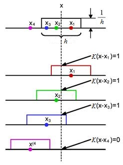

<!--

author:     Alexander Trofimov
attribute:  **Editor:** Daria Gudkova
email:    
date:       21/02/2025
version:    0.1
language:   ru
narrator:   English

icon:    ./icon.png
logo:    ./course_logo.png

comment:  Курс "Введение в машинное обучение"

link:     ./custom.css

import:   ./macro.md
		  ./lec06/window.md

-->

## Байесовская классификация
-----

!?[Lecture06 Video](https://www.youtube.com/watch?v=8pTEmbeENF4)

Байесовская классификация — один из ключевых методов машинного обучения, основанный на теореме Байеса. Этот подход позволяет строить классификаторы, учитывающие вероятностные распределения данных. В лекции мы рассмотрим теоретические основы, постановку задачи, подходы к решению, а также преимущества и ограничения метода.

---
<h3 style="text-align: center;">Содержание раздела</h3>

Порождающие и разделяющие модели классификации. Бинарная функция потерь. Байесовское решающее правило. Дискриминантные функции. Нормальный байесовский классификатор. Расстояние Махаланобиса. Наивный байесовский классификатор. Регуляризованный байесовский классификатор. Байесовская классификация бинарных и мультиномиальных признаков. Пример применения к задаче категоризации документов.

- 
-
-

----
#### Постановка задачи
----

Генеративный и дискриминативный подходы
----

**Дано:**

$𝒟=\{(x^{(1)},y^{(1)}),...,(x^{(n)},y^{(n)})\}$ -- выборка наблюдений
$(x^{(n)},y^{(n)})\in 𝒳×𝒴,\hspace{5mm}i=\overline{1,n}$ 

$𝒴=\{1,...,K\}$ -- метки классов

**Построить:**  

Классификатор $h\in ℋ,\hspace{5mm}ℋ=\{h:h(x),h(x)\in 𝒴\}$

**Подходы к классификации:**

- **Генеративный подход** Цель – обучение (оценивание) совместного ~~распределения~~ $f_{XY}(x,y)$ и его использование для предсказания меток классов. Совместная плотность – это полная информация о наблюдаемом явлении. Например, с её помощью можно генерировать дополнительные данные. 
- **Дискриминативный подход** Цель – обучение (оценивание) ~~отображения~~ $h\in ℋ:𝒳\rightarrow 𝒴$. Решается задача оптимизации: аппроксимация неизвестной функций, аналогично регрессионному анализу, но дискретными откликами.

|Генеративные модели|Дискриминативные модели|
|---|---|
|Строятся модели как входных, так и выходных данных|Строится модель только выходных данных|
|Построение модели входных данных – промежуточный шаг|Явная оптимизация показателя качества классификации|
|Могут быть использованы для генерации входных и выходных данных|Используются для предсказания выхода (метки класса)|

@NB(`Задача оценивания распределения данных обычно более сложная, чем задача построения классификатора данных.`)

В рамках генеративного подхода для решения задачи классификации решается вспомогательная задача оценивания плотностей, которая сложнее самой задачи классификации. Это не рационально, если нам нужен только классификатор, а сама генеративная модель не нужна.

> “When solving a given problem, try to avoid a more general problem as an intermediate step.”
>
> -- Vladimir Vapnik, in Statistical Learning Theory, 1998

Выбор подхода зависит от цели:

- Генеративные модели — для анализа данных и их генерации
- Дискриминативные модели — для простой и эффективной классификации

Задача классификации
----

Построить гипотезу $h \in ℋ$ , минимизирующую эмпирический риск на обучающей выборке:
$$R^*(h)\rightarrow\min_{h\in ℋ}$$

Эмпирический риск $R^*(h)$, связанный с моделью $h$, – это оценка теоретического риска $R(h)$,
$$R(h) = M[L(h, (X, Y ))]$$
где $L(h, (x, y)) \in \mathbb{R^+}$ – функция потерь.

Пусть $L$ – бинарная функция потерь (0-1 loss): 
$$L(h, (x, y)) = 1 - \delta(h(x), y)$$
где $\delta$ – дельта Кронекера:
$$
\delta(h(x),y)=
\begin{cases}
1,\hspace{5mm}h(x)=y
\\
0,\hspace{5mm}h(x)\ne y
\end{cases}
$$

**Риск для дискретного $𝒳$**
$$
R(h)=\sum_{x \in 𝒳}\sum_{y \in 𝒴}{L(h,(x,y))P(X=x\ \&\ Y=y)}
\\
=\sum_{x \in 𝒳}\sum_{y \in 𝒴}{(1-\delta(h(x),y))P(X=x\ \&\ Y=y)}
\\
=1-\sum_{x\in 𝒳}P(X=x)P(Y=h(x)|X=x)
$$

**Оптимальная гипотеза:**
$$R(h)\rightarrow\min_{h\in ℋ}\hspace{5mm}\Rightarrow\hspace{5mm}\sum_{h\in ℋ}P(X=x)P(Y=h(x)|X=x)\rightarrow\max_{h\in ℋ}$$
$$\forall x \in 𝒳\hspace{5mm}h(x)=\arg\max_{h=\overline{1,K}}P(Y=k|X=x)$$

**Риск для непрерывного $𝒳$**
$$
R(h)=\int\int_{𝒳\times 𝒴}L(h,(x,y))f_{XY}(x,y)dxdy
\\\\
=\int\int_{𝒳\times 𝒴}(1-\delta(h(x),y))f_{XY}(x,y)dxdy
\\\\
=1-\int\int_{𝒳\times 𝒴}\delta(h(x),y)f_{X}(x)f_{Y}(y|x)dxdy
\\\\
=1-\int_{𝒳}f_X(x)f_Y(h(x)|x)dx
$$

**Оптимальная гипотеза:**
$$R(h)\rightarrow\min_{h\in ℋ}\hspace{5mm}\Rightarrow\hspace{5mm}\int_{𝒳}f_X(x)f_Y(h(x)|x)dx\rightarrow\max_{h\in ℋ}$$
$$\forall x \in 𝒳\hspace{5mm}h(x)=\arg\max_{k=\overline{1,K}}f_Y(k|x)=\arg\max_{h=\overline{1,K}}P(Y=k|X=x)$$

#### Байесовское решающее правило

Байесовское решающее правило позволяет определить оптимальную метку класса для входного объекта $x$, минимизируя теоретический риск. Суть правила заключается в следующем: для заданного $x$ выбирается метка класса $k$, которая максимизирует апостериорную вероятность $P(Y=k|X=x)$. Именно эта метка и становится результатом работы байесовского классификатора.

@NB(`**Байесовское решающее правило:** Для заданного $x\in 𝒳$ следует выбирать класс $k^*$, если $$P(Y=k^*|X=x)=\max_{k=\overline{1,K}}P(Y=k|X=x)$$`)

$P(Y=k|X=x)$ — **апостериорная вероятность** события $Y=k$, после того как получено наблюдение $x$.

Как оценить $P(Y=k|X=x)$, если на практике мы не можем многократно наблюдать $y$ для фиксированного $x$? В реальных задачах невозможно «заморозить» $x$ и провести сотню экспериментов, чтобы посчитать частоту появления каждой метки. Такой подход непрактичен, особенно при высокой размерности данных или ограниченной выборке.

Здесь на помощь приходит **теорема Байеса**, которая выражает апостериорную вероятность через более удобные для оценки величины.

**Теорема Байеса**:

$$P(Y=k|X=x)=\frac{P(X=x|Y=k)P(Y=k)}{P(X=x)}$$

$$posterior = \frac{likelihood \times prior}{evidence}$$

**Ключевые компоненты формулы:**

1. **posterior** $P(Y=k|X=x)=p_Y(k|x)$ -- **апостериорная** вероятность класса $k$.

2. **prior** $P(Y=k)=p_Y(k)$ -- **априорная** вероятность класса $k$. Это вероятность класса $k$ без учёта признаков $x$. Оценивается по частоте класса в данных. Например, если $90\%$ объектов в выборке относятся к классу $1$, то $P(y=1) = 0.9$.  

3. **likelihood** $P(X=x|Y=k)=p_X(x|k)$ -- **правдоподобие** класса $k$ (условная вероятность наблюдать $x$ при $Y = k$). Это вероятность наблюдения $x$ в классе $k$. Можно выдвинуть некоторое предположение о распределении данных в $k$-м классе (например, то, что оно является нормальным) и оценить, с какой вероятностью $x$ может быть получен из этого распределения. Если $x$ далёк от центра распределения класса (например, $x = 10^6$, а класс сосредоточен около нуля), то правдоподобие будет близко к нулю.

4. **evidence** $P(X=x)=p_X(x)$ -- **безусловная** вероятность наблюдения $x$. Это маргинальная вероятность $x$, не зависящая от меток. ~~Не зависит от гипотезы $h$~~ и может быть исключена из правила.

@NB(`**Байесовское решающее правило:**$$k^*=\arg\max_{k=\overline{1,K}}p_X(x|k)p_Y(k)$$`) 

**Пример** 

Пусть $P(y=1) = 0.9$, $P(y=2) = 0.1$.

Для $x = 10^6$:  

- $P(x|y=1) \approx 0$ (класс $1$ сосредоточен около нуля),  
- $P(x|y=2) \approx 1$ (класс $2$ включает большие значения).  

Решающее правило выберет класс $2$, так как $0.1 \cdot 1 > 0.9 \cdot 0$.  

Дискриминантные функции
----

**Дискриминантной функцией** классификатора $h$ для $k$-го класса, $k=\overline{1,K}$, называется функция $d_k:X\rightarrow\mathbb{R}$ такая, что решающее правило классификатора имеет вид:
$$Выбрать\ класс\ k^*\ для\ x\in 𝒳,\ если\ d_{k^*}(x)=\max_{k=\overline{1,K}}d_k(x)$$
т.е. точка $x$ относится к классу $k$, если значение $d_k(x)$ максимально среди всех $d_1(x), ..., d_K(x)$.

Алгоритм классификации $h$ может быть охарактеризован дискриминантными функциями $d_1(x),...,d_K(x),\ \max_{k=\overline{1,K}}d_k(x)$.

Дискриминантные функции разделяют домен $𝒳$ на **области** (**decision regions**) $ℛ_1,...,ℛ_K$, где $ℛ_k=\{x|d_k(x)=\max_{i=\overline{1,K}}d_i(x)\}$.

Граница между $k$-м и $l$-м классами определяется уравнением $d_k(x)=d_l(x)$, -- это геометрическое место точек, где апостериорные вероятности классов равны. В многомерном пространстве границы могут быть гиперповерхностями сложной формы.

**Граница** (**decision boundary**) между $k$-м и $l$-м классами -- поверхность $b_{kl}$ в $𝒳$, разделяющая области $ℛ_k$ и $ℛ_l$:
$$x\in b_{kl}\Leftrightarrow d_k(x)-d_l(x)=0$$

**Пример.** 

Для трёх классов ($K=3$) дискриминантные функции $d_1(x)$, $d_2(x)$, $d_3(x)$ формируют области принятия решений. Точка $x$ относится к классу $1$, если $d_1(x) > d_2(x)$ и $d_1(x) > d_3(x)$. Области пересечения функций $d_1(x)=d_2(x)$ и $d_2(x)=d_3(x)$ задают границы классов.

График на рисунке ниже изображает дискриминантные функции для случая одномерного пространства признаков $X$. Объекты классов изображены на рисунке в виде маркеров на оси $x$: крестики, ромбы, круги. Дискриминантные функции изображены соответствующими маркерам цветами. Объект $x$ классифицируется в тот класс, чья дискриминантная функция имеет наибольшее значение в данной точке пространства признаков.

@img06(discr_func.png, Пример дискримининтных функций, 30)

---
Подходы к оцениванию плотностей
----

Дискриминантные функции байесовского классификатора:
$$d_k(x)=p_X(x|k)p_Y(k),\hspace{5mm}k=\overline{1,K}$$
На практике, распределения $p_X(x|k)$ и $p_Y(k),\ k=\overline{1,K}$, как правило, неизвестны.

Для того чтобы использовать байесовское решающее правило, необходимо оценить правдоподобия и априорные вероятности каждого класса по данным обучающей выборки.

**Подходы к оцениванию плотностей:**

- Параметрический подход. Предполагается, что выборка получена из некоторого распределения (например, нормального), оценивание его параметров.
- Непараметрический подход. Не делается никаких предположений о виде распределения.

Оценивание по методу максимального правдоподобия
----

**Параметрический подход:**

$𝒟 = \{(x^{(1)}, y^{(1)}), ..., (x^{(n)}, y^{(n)})\}$ -- выборка, полученная из распределения $f_{XY}(x,y|w)$, где $f_{XY}$ -- некоторое ~~неизвестное распределение~~, $w\in\mathbb{R}^L$ -- ~~вектор параметров~~

**Метод максимального правдоподобия:**

Функция правдоподобия (likelihood) выборки $𝒟$:
$$L(𝒟,w)=\prod_{i=1}^nf_{XY}(x^{(i)},y^{(i)}|w)$$

МП-оценивание (maximum likelihood estimation, MLE) вектора параметров 𝑤 -- решение оптимизационной задачи:
$$L(𝒟,w)\rightarrow\max_w$$

Логарифмическая функция правдоподобия (log-likelihood):
$$\ln L(𝒟,w)=\sum_{i=1}^n\ln f_{XY}(x^{(i)},y^{(i)}|w)\rightarrow\max_w$$

Оценивание априорных вероятностей
----

**Дано:**

$𝒟 = \{(x^{(1)}, y^{(1)}), ..., (x^{(n)}, y^{(n)})\}$ — выборка наблюдений

$y(i) \in 𝒴 = \{1,...,K\}$ — метки классов, $i=\overline{1,n}$

**МП-оценки априорных вероятностей $p_Y(k)$:**

$\tilde p_k=\frac{1}{n}\sum_{i=1}^n[y^{(i)}=k]$ – относительная частота $k$-й метки в выборке $𝒟$

~~Эта оценка справедлива, только если выборка $𝒟$ является случайной~~ (не проводились отсев, балансировка или т.п.).

Если выборка $𝒟$ не является случайной, то вероятности  $p_Y(k),\ k=\overline{1,K}$, следует оценивать на основе ~~априорной информации~~ о классах, а не на основе относительных частот меток в выборке $𝒟$.

Байесовское правило для нормального распределения
----

$$X\sim N(m,\sigma)\Leftrightarrow f_X(x|m,\sigma)=\frac{1}{\sigma\sqrt{2\pi}}\exp{(-\frac{(x-m)^2}{2\sigma^2})}$$

**МП-оценки параметров $m$ и $\sigma^2$:**
$$\tilde m = \frac{1}{n}\sum_{i=1}^n x_i=\bar x,\hspace{5mm}\tilde\sigma^2=\frac{1}{n}\sum_{i=1}^n(x_i-\bar x)^2$$

**Лог-дискриминантная функция $k$-го класса, k = 1, ..., K:**
$$\ln d_k(x)=\ln(f_X(x|k)\tilde p_k)=-\ln\tilde\sigma_k-\frac{(x-m)^2}{2\sigma^2}+\ln\tilde p_k+const$$

**Байесовское решающее правило:**
$$k^*=\arg\min_{k=\overline{1,K}}(\frac{(x-m)^2}{2\sigma^2}+\ln\tilde\sigma_k-\ln\tilde p_k)$$

Одномерный нормальный байесовский классификатор
----

Пусть $X$ — одномерная случайная величина, и мы хотим её классифицировать на 2 класса: $К = 2$. 

Пусть классы имеют равные априорные вероятности: $$p_Y (−1) = p_Y (+1) = \frac{1}{2}$$

Рассмотрим два варианта: 

- Условные распределения классов имеют ~~одинаковые дисперсии~~
- Условные распределения классов имеют ~~разные дисперсии~~

----
**Пример. Одинаковые дисперсии.**

Условные распределения классов имеют ~~одинаковые дисперсии~~: 
$$
X|_{-1}\sim N(m_1,\sigma)
\\
X|_{+1}\sim N(m_2,\sigma)
$$

В таком случае маргинальное распределение данных будет иметь два пика, соответствующих скоплениям данных для каждого класса.

Апостериорные вероятности можно вычислить по формуле Байеса. Например, апостериорная вероятность первого класса (красного) рассчитывается как произведение правдоподобия этого класса (его распределения) на априорную вероятность (в данном случае $\frac{1}{2}$), делённое на маргинальное распределение. Аналогично вычисляется апостериорная вероятность для второго класса (зелёного).

Байесовское решающее правило гласит, что произвольную точку следует относить к классу с максимальной апостериорной вероятностью. В данном случае граница между классами соответствует точке пересечения графиков апостериорных вероятностей: все точки левее этой границы классифицируются как красные, а правее — как зеленые.

~~Графики апостериорных вероятностей пересекаются в одной точке: пороговый классификатор~~.

@img06(bayes1.png, Графики при одинаковых дисперсиях, 30)

----
**Пример. Разные дисперсии.**

Условные распределения классов имеют ~~разные дисперсии~~: 
$$
X|_{-1}\sim N(m_1,\sigma_1)
\\
X|_{+1}\sim N(m_2,\sigma_2)
$$

~~Графики апостериорных вероятностей пересекаются в двух точках: квадратичный классификатор.~~

@img06(bayes2.png, Графики при разных дисперсиях, 30)

----
Многомерное нормальное распределение
----

Рассмотрим многомерный случай классификации. Предположим, что вектор признаков $X$ имеет многомерное нормальное распределение. 

$X=(X_1,...,X_M)^T\sim N_M(m,\Sigma)$

$x_i\in\mathbb{R}^M$ -- $i$-е наблюдение СВ X, $i=\overline{1,n}$

В отличие от одномерного случая (который на практике встречается редко, так как большинство данных являются многомерными), здесь  представляет собой вектор, описываемый параметрами: 

$m\in M[X]\in\mathbb{R}^M$ -- вектор мат. ожиданий

$\Sigma=cov(X)$ -- ковариационная матрица размерности $M * M$

**Плотность многомерного нормального распределения:**
$$f_X(x|m,\Sigma)=\frac{1}{\sqrt{(2\pi)^Mdet\Sigma}}\exp(-\frac{1}{2}(x-m)^T\Sigma^{-1}(x-m))$$

**МП-оценки параметров $m$ и $\Sigma$:**
$$\tilde m=\frac{1}{n}\sum_{i=1}^nx_i=\bar x,\hspace{5mm}\tilde\Sigma=\frac{1}{n}\sum_{i=1}^n(x_i-\bar x)(x_i-\bar x)^T$$

**Лог-дискриминантная функция $k$-го класса**, $k = 1, ..., K$:
$$\ln d_k(x)=\ln(f_X(x|k)\tilde p_k)=x^TA_kx+b_k^Tx+c_k+const$$
где
$$
A_k=-\frac{1}{2}\tilde\Sigma_k^{-1},\hspace{5mm}b_k=\tilde\Sigma_k^{-1}\bar x_k
\\
c_k=-\frac{1}{2}\bar x_k^T\tilde\Sigma_k^{-1}\bar x_k-\frac{1}{2}\ln det\tilde\Sigma_k+\ln\tilde p_k
$$

Анализируя структуру дискриминантной функции, можно заметить, что она является квадратичной по $x$, включая квадратичную и линейную составляющие. Следовательно, граница между двумя классами $c_k$ и $c_l$, определяемая уравнением $d_k(x) = d_l(x)$, также будет квадратичной. Однако если ковариационные матрицы классов совпадают ($\Sigma_k = \Sigma_l$), квадратичные члены сокращаются, и граница становится линейной.

Таким образом, в байесовском классификаторе с нормальным распределением границы между классами могут быть ~~либо линейными, либо квадратичными~~. Если же распределение данных отличается от нормального, возможны более сложные формы разделяющих поверхностей.

----
Недостаток байесовского классификатора
----

Обучение байесовского классификатора состоит в оценивании:

- вектора мат. ожиданий для каждого класса: $m_1,...,m_K$
- ковариационных матриц (размерности $M \times M$) для каждого класса: $\Sigma_1,...,\Sigma_K$. Учитывая симметричность ковариационной матрицы, число оцениваемых параметров сокращается до $\frac{M(M + 1)}{2}$ для каждого класса. 
- априорных вероятностей каждого класса: $p_1,...,p_K$

Общее число оцениваемых параметров:
$$KM +KM(M +1)/2+K$$

Для иллюстрации рассмотрим пример с $500$ признаками и $10$ классами. В этом случае требуется оценить $10 \times 500 + 10 \times \frac{500 \times 501}{2} + 10 = 1\ 257 \ 510$ параметров.

Общее количество параметров оказывается чрезвычайно большим, что может привести к проблемам, особенно если объем обучающей выборки недостаточен. Когда число параметров модели превышает количество обучающих примеров, возникает риск переобучения, так как модель обладает избыточной гибкостью. Кроме того, ковариационные матрицы $\tilde\Sigma_1,...,\tilde\Sigma_K$ могут оказаться плохо обусловленными, что увеличивает дисперсию оценок их элементов.  

Рекомендуется, чтобы на каждый параметр модели приходилось не менее 10 обучающих примеров, хотя это правило не является строгим и зависит от сложности задачи. В случае, когда объем данных недостаточен для надежной оценки параметров, возможны два подхода:

- **Сокращение размерности $M$ признакового пространства**. Например, можно использовать метод главных компонент или отобрать наиболее информативные признаки.
- **Ужесточение индуктивного порога**. Это предполагает введение дополнительных ограничений на параметры модели. В частности, можно наложить условия на структуру ковариационных матриц $\Sigma_1,...,\Sigma_K$, что сократит число оцениваемых параметров.

----
Предположения о многомерном нормальном распределении
----

**Предположение 1**. Все распределения имеют одинаковую диагональную ковариационную матрицу (**shared between classes**) с равными дисперсиями (**scalar covariance matrix**):
$$\Sigma_1=...=\Sigma_K=\Sigma=\sigma^2I$$

$X_1,...,X_M$ -- независимые СВ с равными дисперсиями $\sigma^2$, одинаковыми для всех классов.

Нормальные распределения в разных классах отличаются только центрами рассеяния (векторами математических ожиданий), в то время как все остальные параметры распределений (ковариации) совпадают.  

Количество оцениваемых параметров значительно сокращается: достаточно определить лишь один параметр $\sigma^2$. 

Таким образом, распределения в классах являются сферическими и идентичными за исключением положения центров.

@img06(mvn_1.png, Предположение 1, 30)

**Предположение 2**. Все распределения имеют одинаковую диагональную ковариационную матрицу (**shared diagonal covariance matrix**):
$$\Sigma_1=...=\Sigma_K=\Sigma=diag(\sigma_1^2,...,\sigma_M^2)$$

$X_1,...,X_M$ -- независимые СВ с дисперсиями $\sigma_1^2,...,\sigma_M^2$, одинаковыми для всех классов.

Число оцениваемых параметров составляет $M$ (по одному для каждого признака).

Распределения представляют собой эллипсоиды с осями, параллельными осям координат. 

@img06(mvn_2.png, Предположение 2, 30)

**Предположение 3**. Все распределения имеют общую ковариационную матрицу (**shared covariance matrix**):
$$\Sigma_1=...=\Sigma_K=\Sigma$$

$X_1,...,X_M$ -- коррелированные СВ, ковариационная матрица одинаковая для всех классов.

Распределения являются эллипсоидами произвольной ориентации.  

Требуется оценить $\frac{M(M+1)}{2}$ параметров.  

@img06(mvn_3.png, Предположение 3, 30)

**Предположение 4**. Все распределения имеют скалярные ковариационные матрицы (**scalar covariance matrices**):
$$\Sigma_k=\sigma_k^2I,\hspace{5mm}k=\overline{1,K}$$

Скалярная форма матрицы подразумевает, что:

- На главной диагонали расположены одинаковые значения $\sigma^2$, что соответствует равным дисперсиям по всем признакам;
- Все внедиагональные элементы равны нулю, что свидетельствует о некоррелированности признаков. 

$X_1,...,X_M$ -- независимые СВ с одинаковой дисперсией $\sigma_k^2$, разной для разных классов.

Для каждого класса оценивается свой параметр $\sigma_k^2$. Общее число параметров равно $K$ (по одному на класс). 

Распределения остаются сферическими, но с разными радиусами в разных классах.  

@img06(mvn_4.png, Предположение 4, 30)

Сравним эти предположения о структуре ковариационных матриц:

| Модель | Тип ковариационной матрицы | Shared / Not shared | Количество оцениваемых параметров | Распределения |
|---|-------------|-------------------|-----------|-------------|
| Naive | Скалярная | Shared | $1$ | @img06(mvn_1.png, Предположение 1, 100) |
| Naive | Диагональная | Shared | $M$ | @img06(mvn_2.png, Предположение 2, 100) |
| Not naive | Недиагональная | Shared | $\frac{M(M+1)}{2}$ | @img06(mvn_3.png, Предположение 3, 100) |
| Naive | Скалярная | Not shared | $K$ | @img06(mvn_4.png, Предположение 4, 100) |

----
Наивный байесовский классификатор
----

**Наивный байесовский классификатор** -- это байесовский классификатор с предположением о независимости признаков $X_1,...,X_M$.

Поскольку признаки $x_j$ независимы в наивном случае, многомерная плотность является произведением одномерных плотностей. Тогда **решающее правило для наивного классификатора** принимает вид:

$$k^*=\arg\max_{k=\overline{1,K}}p_X(x|k)p_Y(k)=\arg\max_{k=\overline{1,K}}\prod_{j=1}^Mp_{X_j}(x_j|k)p_Y(k)$$

**Главное преимущество наивного подхода**: наивный байесовский классификатор требует ~~только оценивания одномерных распределений~~ $p_{X_1}(x_1|k),...,p_{X_M}(x_M|k),\ k=\overline{1,K}$, или их параметров. С увеличением размерности оцениваемого распределения необходим всё больший объем данных, что может привести к тому, что задача станет неразрешимой. В то время как для оценки одномерных распределений достаточно небольшого объема данных и вычислительная сложность значительно ниже.

**Для многомерного нормального распределения:** наивный случай означает, что ~~ковариационные матрицы $\Sigma_1,...,\Sigma_K$ предполагаются диагональными~~. Поскольку для нормального распределения независимость эквивалентна отсутствию корреляции, все недиагональные элементы ковариационной матрицы равны нулю.

**Замечание. Неверные предположения приводят к неверным выводам**: предположение о независимости признаков может быть неверным. Если признаки фактически зависимы, то:

- Максимизация произведения одномерных плотностей теряет связь с байесовским решающим правилом
- Границы между классами становятся неадекватными

----
Нормальный байесовский классификатор с общей (shared) ковариационной матрицей
----

Предположим, что ков. матрица общая для всех классов, т.е.
$$\Sigma_1=...=\Sigma_K=\Sigma$$

**Лог-дискриминантная функция $k$-го класса, $k = 1, ..., K$:**
$$\begin{aligned}
\ln d_k(x)&=\ln(f_X(x|k)\tilde{p}_k) \\
&=-\frac{1}{2}\ln\det\tilde{\Sigma}-\frac{1}{2}(x-\overline{x}_k)^T\tilde{\Sigma}^{-1}(x-\overline{x}_k)+\ln\tilde{p}_k+const \\
&=-\frac{1}{2}(x^T\tilde{\Sigma}^{-1}x-2x^T\tilde{\Sigma}^{-1}\overline{x}_k+\overline{x}_k^T\tilde{\Sigma}^{-1}\overline{x}_k)+\ln\tilde{p}_k+const \\
&= b_k^Tx+c_k+const
\end{aligned}$$
где 
$$b_k=\tilde{\Sigma}^{-1}\overline{x}_k, \quad c_k=-\frac{1}{2}\overline{x}_k^T\tilde{\Sigma}^{-1}\overline{x}_k+\ln\tilde{p}_k$$

Для нормального байесовского классификатора с общей (shared) ковариационной матрицей ~~дискриминантные функции классов являются линейными~~, значит и границы между классами являются линейными.

**Важное наблюдение:** Тип границы (линейная или квадратичная) определяется тем, одинаковы ли ковариационные матрицы в классах (shared), а не наивностью модели.

**Плотность многомерного нормального распределения:**
$$f_X(x|m,\Sigma)=\frac{1}{\sqrt{(2\pi)^Mdet\Sigma}}\exp(-\frac{1}{2}(x-m)^T\Sigma^{-1}(x-m))$$

**Лог-дискриминантная функция $k$-го класса, k = 1, ..., K:**
$$\ln d_k(x)=\ln(f_X(x|k)\tilde p_k)=-\frac{1}{2}\rho_k^2(x)+\ln\tilde p_k+const$$
где
$$\rho_k(x)=\sqrt{(x-\bar x_k)^T\tilde\Sigma^{-1}(x-\bar x_k)}$$
**-- расстояние Махаланобиса** от $x ∈ 𝒳$ до класса $k ∈ 𝒴$

----
Расстояние Махаланобиса
----

**Расстояние Махаланобиса от точки $x\in \mathbb{R}^M$ до распределения $F_X(x)$** – это расстояние, определяемое как
$$\rho_k(x)=\sqrt{(x-m_X)^T\tilde\Sigma_X^{-1}(x-m_X)}$$
где $m_X$ -– мат. ожидание, $\Sigma_X=cov(X)$ –- ковариационная матрица случайного вектора $X=(X_1,...,X_M)^T$

**Расстояние Махаланобиса от точки $x\in \mathbb{R}^M$ до выборки наблюдений $x_1,...,x_n$** из распределения $F_X(x),\ x\in\mathbb{R}^M$:
$$\rho_k(x)=\sqrt{(x-\bar x_k)^T\tilde\Sigma_X^{-1}(x-\bar x_k)}$$
где $\bar x$ -- среднее, $\tilde\Sigma_X$ -- оценка ковариационной матрицы $\Sigma_X$

**Частные случаи:**

- Ков. матрица $\Sigma_X$ **скалярная**, $\Sigma_X=\sigma^2I$
$$\rho(x)=\frac{1}{\sigma}\sqrt{\sum_{j=1}^M(x_j-m_j)^2}$$
Расстояние Махаланобиса равно ~~евклидову расстоянию~~ (с точностью до множителя)

- Ков. матрица $\Sigma_X$ **диагональная**, $\Sigma_X=diag(\sigma_1^2,...,\sigma_M^2)$ $$\rho(x)=\sqrt{\sum_{j=1}^M\frac{(x_j-m_j)^2}{\sigma_j^2}}$$
Расстояние Махаланобиса равно ~~нормированному евклидову расстоянию~~ 

----
Классификация на основе расстояния Махаланобиса
----

Лог-дискриминантная функция $k$-го класса для нормального байесовского классификатора с общей ковариационной матрицей, $k = 1, ..., K:$
$$\ln d_k(x)=-\frac{1}{2}\rho_k^2(x)+\ln\tilde p_k+const$$
где $\rho_k(x)$ -- расстояние Махаланобиса от $x ∈ 𝒳$ до $k$-го класса.

**Решающее правило для случая равных прайеров:**
$$k^*=\arg\min_{k=\overline{1,K}}\rho_k(x)$$

Это правило называется **Mahalanobis distant-based classification rule**: отнести $x$ к классу, расстояние Махаланобиса до которого минимально.

~~Предположение об общей (shared) ковариационной матрице приводит к решающему правилу Махаланобиса~~.

----
Стандартизация многомерного нормального распределения
----

Когда ковариационная матрица не является ни скалярной, ни диагональной (то есть имеет общий вид), в данных присутствуют корреляции. Для нормального распределения это означает, что эллипс рассеяния данных повёрнут относительно осей координат -- его главные оси не параллельны координатным осям. Можно применить линейное преобразование (умножение на матрицу), которое:

- Повернет систему координат так, чтобы новые оси $(x₁', x₂')$ стали параллельны главным осям эллипса
- В новой системе координат признаки станут независимы и некоррелированы
- Это позволит работать в рамках наивного классификатора без оценки недиагональных элементов ковариационной матрицы

Ковариационная матрица $\Sigma$ обладает следующими свойствами:

- **Симметричная** (следует из определения ковариации)
- **Положительно определенная** (как внешнее произведение векторов)
- Все коэффициенты корреляции по модулю меньше единицы
- Элемент $σ_{ij}$ (ковариация между признаками $x_i$ и $x_j$) меньше $\sqrt{σ_{ii} σ_{jj}}$

**Разложение Холецкого**: любая симметричная положительно определенная матрица (и, т.о., любая ковариационная матрица) $\Sigma$ может быть единственным образом представлена как произведение:
$$\Sigma=LL^T$$
где L – нижняя треугольная матрица (“корень” из $\Sigma$)

Случайный вектор $X\sim N_M(m,\Sigma)$ может быть получен из стандартизованного вектора $U\sim N_M(0, I)$ путем линейного преобразования: 
$$X=LU+m$$ $M[X]=M[LU+m]=LM[U]+m=L\cdot 0 + m = m$ $cov[X]=M[(X-m)(X-m)^T]=M[LUU^TL^T]=LM[UU^T]L^T=LIL^T=LL^T=\Sigma$

**Обратное преобразование (стандартизация)**. Для перехода от коррелированного вектора $X$ к некоррелированному вектору $U$:  $X\sim N_M(m,\Sigma):\ U=L^{-1}(X-m)$

- Нормальный закон композиционно устойчив: линейное преобразование нормально распределенного вектора дает нормально распределенный вектор
- В одномерном случае это сводится к знакомой формуле: $\frac{x-m}{σ}$

----
Nearest Mean Classifier
----

$\Sigma^{-1}=(LL^T)^{-1}=(L^T)^{-1}L^{-1}=(L^{-1})^TL^{-1}$

Расстояние Махаланобиса от $x\in 𝒳$ до класса $k\in 𝒴$:
$$\begin{aligned}
\rho_k^2(x)&=(x-\overline{x}_k)^T\tilde{\Sigma}^{-1}(x-\overline{x}_k) \\
&=(x-\overline{x}_k)^T(\tilde{L}^{-1})^T\tilde{L}^{-1}(x-\overline{x}_k) \\
&=(\tilde{L}^{-1}(x-\overline{x}_k))^T(\tilde{L}^{-1}(x-\overline{x}_k))=||\tilde{L}^{-1}x-\tilde{L}^{-1}\overline{x}_k||^2
\end{aligned}$$
где $||\cdot||$ -- **евклидова норма** 

**Геометрическая интерпретация**. Расстояние Махаланобиса - это обычное евклидово расстояние в линейно преобразованном пространстве:

- Умножение на $L^{-1}$ поворачивает исходную систему координат
- В новой системе координат $x$ преобразуется в $x' = L^{-1}x$
- Центр класса преобразуется в $x̄'ₖ = L^{-1}x̄ₖ$
- В этом новом пространстве вычисляется обычное евклидово расстояние

**Решающее правило для случая равных прайеров**:
$$\displaystyle k^\ast = \arg\min\limits_{k=\overline{1,K}}||\tilde{L}^{-1}x-\tilde{L}^{-1}\overline{x}_k|| = \arg\min\limits_{k=\overline{1,K}}||x^\prime-\overline{x}^\prime_k||$$

Это правило называется **the nearest mean classification rule**: отнести $x^\prime$ к классу, евклидово расстояние до центра которого минимально среди $\overline{x}^\prime_1,...,\overline{x}^\prime_K$

----
Расстояние Махаланобиса vs. Евклидово расстояние
----

|Свойство|Расстояние Махаланобиса|Евклидово расстояние|
|---|---|---|
|**Размерность**|Безразмерное: измеряется в единицах стандартного отклонения $\sigma$| Измеряется в исходных единицах признаков|
|**Форма линий уровня**|Асимметричность: эллипсы, ориентация которых зависит от ковариационной матрицы|Симметричность: концентрические окружности|
|**Зависимость от распределения**|Учитывает ковариацию данных| Не зависит от распределения|
|**Интерпретация**|"Статистическое расстояние" с учетом изменчивости данных| Геометрическое расстояние в исходном пространстве|
|**Формула**|Расстояние Махаланобиса можно выразить через евклидово расстояние в преобразованном пространстве: $$\rho_k^2(x) = ||\tilde{L}^{-1}(x-\overline{x}_k)||^2$$|Евклидово расстояние -- частный случай расстояния Махаланобиса при $\Sigma = I$: $$d_k^2(x) = ||x-\overline{x}_k||^2$$|
|**Иллюстрация**|@img06(mahal_1.png, Расстояние Махаланобиса, 88)|@img06(mahal_2.png, Евклидово расстояние, 100)|

----
Агрегированная оценка ковариационной матрицы
----

1. **Без предположений.** Оценка ковариационной матрицы в каждом классе находится по стандартной формуле.

**Индивидуальные оценки матрицы $\Sigma$:**
$$\tilde\Sigma_k=\frac{1}{n_k}\sum_{i=1}^{n_k}(x_{ki}-\bar x_k)(x_{ki}-\bar x_k)^T,\hspace{5mm}k=\overline{1,K}$$
$x_{k1},...,x_{kn_k}$ -- выборка наблюдений СВ $X_k,\ k=\overline{1,K}$

2. **Shared ковариационная матрица**. Предположение: случайные векторы $X_1,...,X_K$ имеют одинаковую ков. матрицу.
$$cov(X_1)=...=cov(X_K)=\Sigma,\hspace{5mm}\Sigma\in\mathbb{R}^{M\times M}$$

Проблема: это предположение не выполнится в большинстве случаев, т.к. оценки $\tilde\Sigma_k$ в каждом классе будут различны. Для решения этой проблемы используется **агрегированная оценка** ков. матрицы:

**Смещенная**: $\tilde\Sigma=\frac{1}{\sum_{k=1}^Kn_k}\sum_{k=1}^Kn_k\tilde\Sigma_k$

**Несмещенная**: $\tilde\Sigma=\frac{1}{\sum_{k=1}^K(n_k-1)}\sum_{k=1}^Kn_k\tilde\Sigma_k$

3. **Scalar ковариационная матрица**. Предположение: все истинные дисперсии одинаковы.

- Вычисляются индивидуальные оценки дисперсии каждого класса: $\hat{\sigma}_1^2, \hat{\sigma}_2^2, \hat{\sigma}_3^2, ...$
- Находится среднее арифметическое: $\hat{\sigma}^2 = \frac{1}{d}\sum_{j=1}^d \hat{\sigma}_j^2$
- Это значение ставится на главную диагональ ков. матрицы

----
Предположения в байесовской классификации
----

<!-- data-type="none"-->
|Предположения | Cov. matrix | # params| Boundary|
|---|---|---|---|
|Shared, scalar| $$\sigma^2I$$ | $$1$$ | Linear|
|Shared, diagonal| $$Σ = diag(\sigma^2_1,...,\sigma^2_M)$$ | $$M$$ | Linear|
|Scalar | $$\sigma^2_1I,...,\sigma^2_KI$$ | $$K$$ | Quadratic|
|Diagonal | $$Σ_1,...,Σ_K,$$ $$cov(X_i, X_j | k) = 0$$ | $$KM$$ | Quadratic|
|Shared| $$Σ_1 =...= Σ_K = Σ$$ | $$M(M + 1)/2$$ | Linear|
|Без предположений | $$Σ_1,...,Σ_K$$ | $$KM(M + 1)/2$$ | Quadratic|

----
Иллюстрация различных типов границ решений.
----

Рассмотрим, как различные предположения о ковариационных матрицах влияют на тип границы решений на примере 2-D нормального байесовского классификатора. 

$X$ -- двумерный вектор 

$K = 2$ класса

**Прайеры:** равные  ($p_Y(-1)=p_Y(+1)=1/2$)

**Пример 1. Ков. матрицы: shared, scalar.**

**Распределения:** 
$$
X|_{-1}\sim N(m_1,\sigma^2I)
\\
X|_{+1}\sim N(m_2,\sigma^2I)
$$

**Nearest mean classification**

Два круговых распределения. Апостериорные вероятности пересекаются вдоль ~~прямой линии~~.

@img06(bayes2_1.png, shared scalar, 30)

---
**Пример 2. Ков. матрицы: shared, diagonal.**

**Распределения:** 
$$
X|_{-1}\sim N(m_1,\Sigma)
\\
X|_{+1}\sim N(m_2,\Sigma)
\\
\Sigma=diag(\sigma_1^2,\sigma_2^2)
$$

**Mahalanobis distance-based classification**

Эллиптические распределения с осями, параллельными координатным осям. Апостериорные вероятности пересекаются вдоль ~~прямой линии~~.

@img06(bayes2_2.png, shared diagonal, 30)

---
**Пример 3. Ков. матрицы: shared.**

**Распределения:** 
$$
X|_{-1}\sim N(m_1,\Sigma)
\\
X|_{+1}\sim N(m_2,\Sigma)
$$

**Mahalanobis distance-based classification**

Произвольно ориентированные эллипсы. Апостериорные вероятности пересекаются вдоль ~~прямой линии~~.

@img06(bayes2_3.png, shared, 30)

---
**Пример 4. Ков. матрицы: scalar**

**Распределения:** 
$$
X|_{-1}\sim N(m_1,\sigma_1^2I)
\\
X|_{+1}\sim N(m_2,\sigma_2^2I)
$$

**Naive classification**

Два круговых распределения с разными дисперсиями. Апостериорные вероятности пересекаются вдоль ~~кривой 2-го порядка~~.

@img06(bayes2_4.png, scalar, 30)

---
**Пример 5. Ков. матрицы: diagonal**

**Распределения:** 
$$
X|_{-1}\sim N(m_1,\Sigma_1)
\\
X|_{+1}\sim N(m_2,\Sigma_2)
\\
\Sigma_1=diag(\sigma_{11}^2,\sigma_{21}^2)
\\
\Sigma_2=diag(\sigma_{12}^2,\sigma_{22}^2)
$$

**Naive classification**

Эллипсы с осями, параллельными координатным осям. Апостериорные вероятности пересекаются вдоль ~~параболы~~.

@img06(bayes2_5.png, diagonal, 30)

---
**Пример 6. Ков. матрицы: нет предположений.**

**Распределения:** 
$$
X|_{-1}\sim N(m_1,\Sigma_1)
\\
X|_{+1}\sim N(m_2,\Sigma_2)
$$

Произвольно ориентированные эллипсы. Апостериорные вероятности пересекаются вдоль ~~параболы~~.

@img06(bayes2_6.png, diagonal, 30)

---
**Пример 7. Ков. матрицы: нет предположений.**

**Распределения:** 
$$
X|_{-1}\sim N(m_1,\Sigma_1)
\\
X|_{+1}\sim N(m_2,\Sigma_2)
$$

Апостериорные вероятности пересекаются вдоль ~~эллипса~~.

- Один класс имеет очень маленькую дисперсию
- Все точки внутри эллипса относятся к классу с малой дисперсией
- Все точки вне эллипса - к классу с большой дисперсией

@img06(bayes2_7.png, diagonal, 30)

---
**Пример 8. Ков. матрицы: нет предположений.**

**Распределения:** 
$$
X|_{-1}\sim N(m_1,\Sigma_1)
\\
X|_{+1}\sim N(m_2,\Sigma_2)
$$

Апостериорные вероятности пересекаются вдоль ~~гиперболы~~.

- Все точки внутри гиперболы -- один класс
- Все точки вне гиперболы -- другой класс
- Возникает при специфическом соотношении дисперсий по разным направлениям

**Парадокс расстояний.** Из-за различий в дисперсиях классов точка может быть ближе по евклидову расстоянию к одному классу, и одновременно ближе по расстоянию Махаланобиса к другому классу.

@img06(bayes2_8.png, diagonal, 30)

----
Регуляризованный байесовский классификатор
----

Как выбрать подходящие предположения о структуре ковариационной матрицы? Можно использовать предположения для регулировки индуктивного порога.

**Комбинированная оценка ков. матриц классов:**

$$\tilde\Sigma_k=\alpha\tilde\Sigma^{nearest}+\beta\tilde\Sigma^{linear}+(1-\alpha-\beta)\tilde\Sigma_k^{quadratic}$$

$\tilde\Sigma^{nearest}=\sigma^2I$ – shared scalar ков. матрица (соответствует ~~nearest mean классификатору~~)  

$\tilde\Sigma^{linear}$ – shared ков. матрица (соответствует ~~Mahalanobis distance-based классификатору~~) 

$\tilde\Sigma_k^{quadratic}$ – ков. матрица $k$-го класса (соответствует ~~квадратичному классификатору~~)

$\alpha, \beta$ – параметры, $\alpha ≥ 0, \beta ≥ 0, \alpha + \beta ≤ 1$ 

Малые значения $\alpha$ и $\beta$ означают слабый индуктивный порог, высокие значения $\alpha$ и $\beta$ означают сильный индуктивный порог.

Байесовский классификатор, использующий комбинированную оценку ков. матриц, называется **регуляризованным байесовским классификатором (regularized Bayes classifier)**

#### Байесовский классификатор дискретных признаков

В байесовском классификаторе неважно, какое именно распределение предполагается для признаков. Суть обучения байесовского классификатора -- оценка параметров распределения по выборке. Для каждого типа распределения нужно:

- Определить параметры распределения
- Оценить эти параметры по обучающей выборке
- Использовать оценки в байесовском решающем правиле

----
Байесовский классификатор бинарных признаков
----

Пусть $X=(X_1,...,X_M)^T$ -- вектор бинарных (распределенных по закону Бернулли) СВ: $X_j\sim B(1,p_j),\ x_j\in\{0,1\}$

**Пример**: черно-белое изображение, развернутое в вектор.

$X_j|k\sim B(1,p_{jk}),\ p_{jk}=P(X_j=1|k)$

Условные вероятности: $P(X_j=x_j|k)=p_{jk}^{x_j}(1-p_{jk})^{(1-x_j)}$

**Байесовское правило:** $k^*=\arg\max_{k=\overline{1,K}}p_X(x|k)p_Y(k)$

**Наивный случай** (все признаки $X_1, X_2, ..., X_m$ независимы): $p_X(x|k)=\prod_{j=1}^MP(X_j=x_j|k)$

**Лог-дискриминантная функция $k$-го класса**, $k=\overline{1,K}$:
$$

\ln d_k(x)=\ln(p_X(x|k)p_Y(k))=\sum_{j=1}^M\ln P(X_j=x_j|k)+\ln P_Y(k)=
\\
=\sum_{j=1}^M(x_j\ln p_{jk}+(1-x_j)\ln(1-p_{jk}))+\ln p_Y(k)
$$

----
Байесовский классификатор мультиномиальных признаков
----

Пусть $X=(X_1,...,X_M)^T$ -- вектор мультиномиально распределенных СВ $X\sim Mult(N,p_1,...,p_m)$

$$\sum_{j=1}^Mp_j=1,\hspace{5mm}x_j\in\{0,...,N\},\hspace{5mm}\sum_{j=1}^Mx_j=N$$

$N$ -- число экспериментов

$X_j$ -- число успехов в $j$-й категории, $j=1,...,M$

**Пример.** $N$ независимых бросаний кубика с $M$ гранями.

Биномиальное распределение -- частный случай мультиномиального распределения при $M = 2$.

$X|k\sim Mult(N,p_{1k},...,p_{Mk})$

Условные вероятности: $P(X=x|k)=\frac{N!}{\prod_{j=1}^Mx_j!}\prod_{j=1}^Mp_{jk}^{x_j}$

Байесовское правило: $k^*=\arg\max_{k=\overline{1,K}}p_X(x|k)p_Y(k)$

**Лог-дискриминантная функция $k$-го класса, $k=1,...,K$:**
$$\ln d_k(x)=\ln(p_X(x|k)p_Y(k))=\sum_{j=1}^Mx_j\ln p_{jk}+\ln p_Y(k)+const$$

----
**Пример. Категоризация документов.**
----

Задача категоризации документов состоит в том, чтобы отнести документ к одной из заданных категорий (например, политика, спорт, мода и т.д.)

Это задача многоклассовой классификации.

Подход **bag-of-words** – упрощенное представление документа в виде набора слов, игнорирующее грамматику и порядок слов. В подходе bag-of-words признаками документа являются частоты содержащихся в нем слов.

Обозначения:

- $n$ – число документов  
- $K$ – число категорий (классов)  
- $M$ – число слов в словаре (множество слов $w_1,...,w_M$)  
- $n_k$ – число документов в $k$-й категории  
- $n_{jk}$ – число документов $k$-й категории, содержащих слово $w_j$

Чтобы использовать наивный байесовский классификатор, нужна вероятностная модель данных. Рассмотрим модель Бернулли и мультиномиальную модель. 

**1. Категоризация документов: модель Бернулли**

Признак документа $x_j=1$, если слово $w_j$ встречается в документе и $x_j=0$ иначе, $j=1,...,M$.

Вектор признаков $X=(X_1,...,X_M)^T$, $X_j\sim B(1,p_j)$.

Вектор признаков $i$-го документа $x^{(i)}=(x_1^{(i)},...,x_M^{(i)})^T$ -- бинарный вектор, $i=1,...,n$ 

**Лог-дискриминантная функция** $k$-го класса, $k=1,...,K$:
$$\ln d_k(x)=\sum\limits_{j=1}^M(x_j\ln \tilde{p}_{jk}+(1-x_j)\ln(1-\tilde{p}_{jk}))+\ln\tilde{p}_Y(k)$$

Оценка параметров распределения Бернулли $p_{jk}$ (вероятность того, что $j$-е слово встречается в $k$-й категории) вычисляется как относительная частота документов $k$-го класса, содержащих это слово $w_j$.$$\tilde{p}_{jk}=\frac{n_{jk}}{n_k}$$

Априорные вероятности категорий можно оценить как относительные частоты документов в каждом k-м классе.$$\tilde{p}_Y(k)=\frac{n_k}{n}$$ 

**Недостаток**: бинарная модель не учитывает частоты слов, только их наличие или отсутствие, что приводит к потери информации.

**2. Категоризация документов: мультиномиальная модель**

Признак $x_j$ -- частота слова $w_j$ в документе, $j=1,...,M$ 

Вектор признаков $X=(X_1,...,X_M)^T\sim Mult(N,p_1,...,p_M)$ 

$N$ -- число слов в документе 

Вектор признаков $i$-го документа $x^{(i)}=(x_1^{(i)},...,x_M^{(i)})^T$ -- целочисленный вектор, $i=1,...,n$ 

**Лог-дискриминантная функция** $k$-го класса, $k=1,...,K$:
$$\ln d_k(x)=\sum_{j=1}^Mx_j\ln \tilde{p}_{jk}+\ln \tilde{p}_Y(k)$$

$\tilde{p}_{jk}=\frac{\sum_{i:y_i=k}x_j^{(i)}}{\sum_{i:y_i=k}N_i}=\frac{\sum_{i:y_i=k}x_j^{(i)}}{\sum_{q=1}^M\sum_{i:y_i=k}x_q^{(i)}}$ -- относительная частота слова $w_j$ в документах $k$-го класса

$\tilde{p}_Y(k)=\frac{n_k}{n}$ -- относительная частота документов $k$-го класса

**Недостаток** относительных частот как оценок параметров мультиномиального распределения: отсутствие слова в категории означает его нулевую частоту. 

$\tilde{p}_{jk}=0$ хотя бы для одного слова $w_j$ приводит к нулевому правдоподобию $\tilde{p}_X(x|k)=0$ и нулевой апостериорной вероятности $\tilde{p}(k|x)$. 

Тот факт, что слово $w_j$ не встречается в документах некоторой категории в обучающей выборке, не означает, что оно не может встретиться в других документах этой категории.

Чтобы избежать этого, применяют сглаживание Лапласа: во все категории добавляют фиктивный документ, в котором каждое слово встречается ровно один раз. Это гарантирует, что ни одна вероятность не будет равна нулю. 

**Сглаживание Лапласа при оценивании вероятностей** $p_{jk}$:

Для биномиального распределения
$$\tilde{p}_{jk}=\frac{1+n_{jk}}{2+n_k}$$

Для мультиномиального распределения
$$\tilde{p}_{jk}=\frac{1+\sum_{i:y_i=k}x_j^{(i)}}{M+\sum_{q=1}^M\sum_{i:y_i=k}x_q^{(i)}}$$

## Непараметрическое оценивание плотностей

Непараметрический подход оценивает плотности непосредственно по данным, без каких-либо предположений о виде распределения в каждом классе. 

Рассмотрим отличия параметрического и непараметрического подходов на примере нормального распределения. Функция $f(x)$ определена на всей числовой оси $(-\infty, +\infty)$. Для параметрического подхода: достаточно хранить только параметры $\mu$ и $\sigma^2$. В то время как для непараметрического подхода нужно хранить всю функцию. Есть несколько вариантов решения этой проблемы:

1. **Хранение функции по точкам**

   - Разбить числовую ось (не всю ось, а в некотором разумном диапазоне) с шагом дискретизации
   - Хранить массив значений функции в этих точках
   - Если реальное $x$ попадет между двумя соседними точками, то использовать интерполяцию, чтобы получить значение функции в точке $x$

2. **Вычисление на "лету"**

   - Хранить исходные данные
   - Применять алгоритм построения функции по данным каждый раз при необходимости значения функции

Алгоритмы обучения, требующие хранения обучающей выборки или производных от неё структур данных, называют **instance-based** (**memory-based**).

|Параметрическое оценивание|Непараметрическое оценивание|
|---|---|
|Задача сводится к оцениванию небольшого числа параметров распределения|Непараметрические методы пытаются оценить плотность непосредственно по данным, не предполагая конкретного вида распределения|
|Предположение о виде распределения может быть неверным, в этом случае оценивание не имеет смысла|Увеличенная потребность в памяти и вычислениях|

### Наивное оценивание

Непараметрическое оценивание плотности
----

Оценивание плотностей распределений является классической задачей математической статистики и одной из задач обучения без учителя (unsupervised learning).

**Дано:** 

$x_1,...,x_n$ – выборка наблюдений СВ $X\sim f_X(x),\ x\in\mathbb{R}$

**Требуется:** 

оценить плотность распределения $f(x)$

Классический подход основан на построении эмпирической функции распределения.

**Непараметрическая оценка функции распределения вероятностей $F_X(x)$:**

$\tilde F(x)=\frac{\sum_{i=1}^n[x_i<x]}{n}$ -- эмпирическая функция распределения.

Свойства эмпирической функции:

- Кусочно-постоянная функция
- Имеет скачки в точках наблюдений $xᵢ$
Величина скачка равна частоте наблюдения ($1/n$ для одного значения)
- Является несмещенной, состоятельной и эффективной оценкой

Плотность распределения $f(x)$ является производной функции распределения. Однако прямое взятие производной от эмпирической функции приводит к проблемам:

- Производная равна нулю везде, кроме точек разрыва
- В точках разрыва производная бесконечна (дельта-функции)

Для решения этих проблем используется дискретная аппроксимация производной с конечным параметром $h$:

**Непараметрическая оценка функции плотности $f_X(x)$:**

$$\tilde f(x)=\frac{\tilde F(x+h)-\tilde F(x)}{h}=\frac{1}{h}\frac{\sum_{i=1}^n[x\le x_i<x+h]}{n}$$
$h$ -- ширина интервала. Наблюдения $x_i$, попадающие в интервал ширины $h$, считаются “достаточно близкими”.

Что означает “достаточно близкие” и как выбрать $h$?

- При очень малом $h$ получаем дельта-функции
- При очень большом $h$ теряем детали распределения

Гистограммное оценивание
----

Реализуя эту идею дискретной аппроксимации производной, разобьем диапазон наблюдений на интервалы равного размера, называемые ~~столбиками~~ (~~bins~~).

Для заданных $x_0$ и ширины $h$, столбики – это интервалы 
$$[x_0,x_0+h],...[x_0+(k-1)h,x_0+kh]$$
где $k$ -- число столбиков 

В каждом интервале считаем частоты, то есть количество $x$, которые попали в интервал. Таким образом, получаем гистограмму, то есть функцию, которая внутри интервала будет равна константе, равной относительной частоте попадания наблюдений в этот интервал.

**Гистограммное оценивание (histogram estimator):**
$$\tilde f(x)=\frac{x_i, in\ the\ same\ bin\ as\ x}{nh}$$

**Параметры:** ширина столбиков $h$ и начальная точка $x_0$

**Недостатки:**

- оценка зависит от начальной точки $x_0$
- разрывы оцененной функции плотности 
- проклятие размерности: число столбиков растет экспоненциально с увеличением размерности

Наивное оценивание
----

Классическая гистограмма использует неперекрывающиеся интервалы фиксированной ширины. Это приводит к кусочно-постоянной функции с резкими скачками на границах интервалов. Вместо статичных интервалов можно использовать скользящее окно $[x - h/2, x + h/2]$ фиксированной ширины $h$, которое непрерывно перемещается по области определения.

1. **Определение окна**: для каждой точки $x$ создается окно $[x - h/2, x + h/2]$
2. **Подсчет точек**: определяется количество наблюдений $xᵢ$, попадающих в данное окно: $n_w$
3. **Вычисление оценки**: плотность вычисляется по формуле:

$f̃(x) = n_w / (n × h)$

Такой алгоритм называется наивной оценкой плотности.

@window(0)

**Наивная оценка (naive estimator) плотности $f(x)$:**
$$\tilde f(x)=\frac{x_i\ in\ [x-h/2,x+h/2]}{nh}=\frac{\sum_{i=1}^n[x-h/2\le x_i<x+h/2]}{nh}$$

Эта оценка может быть записана в виде:
$$\tilde f(x)=\frac{1}{nh}\sum_{i=1}^n[|\frac{x-x_i}{h}|<\frac{1}{2}]=\frac{1}{nh}\sum_{i=1}^nK(\frac{x-x_i}{h})$$
где $K(u)=\begin{cases}1,\hspace{5mm} |u|<1/2\\0,\hspace{5mm} otherwise \end{cases}$

Каждое наблюдение $x_i$ имеет симметричную зону влияния ширины $h$ вокруг себя и дает вклад $= 1$ для всех $x$, попадающих в нее.

По сравнению с классической гистограммой наивная оценка дает более гладкое приближение истинной плотности: большее количество (до $2n$) мелких скачков в точках $x_i\pm h/2$ вместо нескольких крупных. Кроме того наивная оценка не зависит от выбора начальной точки разбиения $x_0$.

**Две эквивалентные интерпретации**

1. Окно вокруг точки оценки. Для вычисления $f̃(x)$ строим окно вокруг точки $x$ и подсчитываем количество $n_w$ наблюдений, попадающих в это окно.

2. Зоны влияния наблюдений. Каждое наблюдение $xᵢ$ имеет зону влияния — окно ширины $h$ с центром в $xᵢ$. Для вычисления $f̃(x)$ определяем, в скольких зонах влияния находится точка $x$.
Например, при наличии $4$ наблюдений и попадании точки $x$ в зоны влияния трех из них, оценка плотности составит $\frac{3}{4h}$.

### Ядерное оценивание

**Ядерная оценка (kernel estimator) плотности 𝑓(x):**
$$\tilde f(x)=\frac{1}{nh}\sum_{i=1}^nK(\frac{x-x_i}{h})$$
где:

- $K(u)$ – **ядерная функция** (**окно Парзена-Розенблатта**),
- $h$ – **ширина окна** (**smoothing parameter, bandwidth**)

Вместо того, чтобы придавать равный вес каждой точке в зоне влияния $x_i$, будем присваивать вес, который непрерывно уменьшается к нулю по мере удаления от $x_i, i=\overline{1,n}$

Ядерная функция $K(u)$ обычно выбирается как ~~симметричная плотность распределения~~, удовлетворяющая условиям:

$$K(u)\geq 0 \quad \forall u\in\mathbb{R}$$

$$\int_{-\infty}^{\infty}K(u)du=1$$

$$K(u)=K(-u)$$
 
$$\int_{-\infty}^{\infty}uK(u)du=0$$

$$\int_{-\infty}^{\infty}u^2K(u)du=\sigma^2_K<\infty$$

**Виды ядерных функций**:

Прямоугольное ядро: $$K(u)=\begin{cases}\frac{1}{2},\hspace{5mm}|u|<1\\0,\hspace{5mm}otherwise\end{cases}$$

Гауссово ядро: $$K(u)=\frac{1}{\sqrt{2\pi}}\exp(-\frac{u^2}{2})$$

Ядро Епанечникова: $$K(u)=\begin{cases}\frac{3}{4}(1-u^2),\hspace{5mm}|u|<1\\0,\hspace{5mm}otherwise\end{cases}$$

Треугольное ядро: $$K(u)=\begin{cases}1-|u|,\hspace{5mm}|u|<1\\0,\hspace{5mm}otherwise\end{cases}$$

@img06(kernels.png, Kernel functions, 30)

Bias-Variance Decomposition
----

**Ядерная оценка плотности** $f(x):\tilde f(x)=\frac{1}{nh}\sum_{i=1}^nK(\frac{x-x_i}{h})$

**Мат. ожидание оценки $f(x)$ в точке x:︂**
$$\begin{aligned}\mu(x)&=M[\tilde{f}(x)]=\frac{1}{nh}\sum\limits_{i=1}^n M\left[K\left(\frac{x-X_i}{h}\right)\right] \\
&=\frac{1}{h}\int\limits_{-\infty}^{\infty}K\left(\frac{x-\xi}{h}\right)f(\xi)d\xi
\end{aligned}$$

**Мат. ожидание квадрата ошибки оценки в точке $x$:**
$$\begin{aligned}\varepsilon^2(x)&=M\left[(\tilde{f}(x)-f(x))^2\right]=M\left[\tilde{f}^2(x)\right]-2f(x)M\left[\tilde{f}(x)\right]+f^2(x) \\
&=D\left[\tilde{f}(x)\right]+\left(M\left[\tilde{f}(x)\right]\right)^2-2f(x)M\left[\tilde{f}(x)\right]+f^2(x) \\
&=D\left[\tilde{f}(x)\right]+(\mu(x)-f(x))^2=Var(\tilde{f}(x))+Bias^2(x) \end{aligned}$$

- $Bias(x)$ – ~~систематическая ошибка~~, связанная с оценкой
- $Var(x)$ – ~~случайная ошибка~~ оценивания

~~Соотношение~~ (~~trade-off~~) между $Bias(x)$ и $Var(x)$ определяется шириной окна $h$.

|Undersmoothing|Oversmoothing|
|---|---|
|Малые $h$ ⇒ малое смещение, но высокая дисперсия оценки по различным обучающим выборкам|Большие $h$ ⇒ малые различия между оценками, полученными по различным обучающим выборкам|
|@img06(kernel3.png, Undersmoothing, 100)|@img06(kernel2.png, Oversmoothing, 100)|

Оптимальная ширина окна
----

**Mean integrated squared error (MISE)** оценки $\tilde f(x)$:

$$MISE(\tilde{f})=\int\limits_{-\infty}^{\infty}\varepsilon^2(x)dx=\int\limits_{-\infty}^{\infty}Var(\tilde{f}(x))dx + \int\limits_{-\infty}^{\infty}Bias^2(x)dx$$

Можно [показать](https://web.archive.org/web/20200321005445id_/http://web.ipac.caltech.edu/staff/fmasci/home/astro_refs/DensityEstimation.pdf), что:
$$MISE(\tilde f)\approx\frac{1}{nh}R(K)+\frac{h^4}{4}\sigma_K^4R(f'')$$
где $R(f)=\int\limits_{-\infty}^{\infty}f^2(x)dx$

**Ширина окна $h_{MISE}$, минимизирующая MISE:**
$$h_{MISE}=(\frac{R(K)}{\sigma_K^4R(f'')})^{1/5}n^{-1/5}$$

Подходы к выбору ширины окна
----

1. **Предположение о нормальности (reference to normal)**

Оптимальная ширина $h_{MISE}$ зависит от неизвестной плотности $f(x)$. Предполагая, что $f(x)$ – плотность нормального распределения:
$$h_{MISE}=1.06\tilde\sigma n^{-1/5},\ or\ h_{MISE}=0.79\Delta n^{-1/5}$$

**Ширина окна Сильвермана (Silverman’s bandwidth)**:
$$h_{MISE}=0.9\min(\tilde\sigma,\frac{\Delta}{1.34})n^{-1/5}$$
где $\Delta=x_{0.75}-x_{0.25}$ – **интерквартильный интервал**

2. **Кросс-валидационные методы (CV methods)**

3. **Плагин-методы (plug-in methods)**

Заменяем $f''(x)$ в выражении для $h_{MISE}$ на оценку $\tilde f''(x)$ при ширине окна $g=g(h_{MISE})$

Оценивание многомерной плотности
----

$x_1,...,x_n$ – выборка наблюдений СВ $X\sim f_X(x),\ x\in\mathbb{R}^M$

$x_i=(x_{1i},...,x_{Mi})^T\in\mathbb{R}^M,\ i=\overline{1,n}$

**Случай независимых ядер (product kernel estimator):**
$$\tilde f(x)=\frac{1}{nh_1*...*h_M}\sum_{i=1}^n\prod_{j=1}^MK(\frac{x_j-x_{ji}}{h_j})$$
где:

- $K(u)$ – ядерная функция, 
- $h_1, ..., h_M$ – ширины окон

**Случай независимых признаков:**
$$\tilde f(x)=\prod_{j=1}^M\tilde f_j(x_j)=\frac{1}{n^Mh_1*...*h_M}\prod_{j=1}^M\sum_{i=1}^nK(\frac{x_j-x_{ji}}{h_j})$$

Предположение о независимости ядер не означает предположение о независимости признаков.

Ширина окна Сильвермана
----

Mean integrated squared error (MISE) оценки $f(x)$ может быть обобщено на многомерный случай $x=(x_1,...,x_M)^T$ :
$$MISE(\tilde f)\approx\frac{1}{nh^M}R(K)+\frac{h^4}{4}\sigma_K^4\int_{-\inf}^{\inf}(tr H_f(x))^2dx$$
где $H_f(x)$ – $M\times M$ матрица Гессе, $h$ – ширина окна (одинаковая для всех измерений)

Предполагая, что $f(x)$ – многомерное нормальное распределение с диагональной ковариационной матрицей:
$$h_j=(\frac{4}{M+2})^{1/(M+4)}\tilde\sigma_jn^{-1/(M+4)},\ j=\overline{1,M}$$
Для $M = 1$: $h=1.06\tilde\sigma n^{-1/5}$

Гиперсферы в многомерном пространстве
----

**Для стандартного одномерного нормального распределения** $U\sim N(0,1)$:
$$P(||U||<1.6)=0.9$$
$90\%$ данных лежат в интервале $[-1.6,1.6]$ 

**Для двумерного нормального распределения**:
$$P(||U||<1.6)=P(\sqrt{U_1^2+U_2^2}<1.6)=P(\chi^2(2)<2.56)=0.72$$
$72\%$ данных лежат внутри окружности радиуса $1.6$ 

**Для $M$-мерного нормального распределения**:
$$P(||U||<1.6)=P(\chi^2(M)<2.56)$$

С ростом $M$ вероятность стремится к $0$ при любом фиксированном радиусе.

Феномен пустых пространств
----

С ростом размерности пространства $M$ гиперсфера любого фиксированного радиуса ограничивает незначительный объем. Выборка становится сильно разреженной. 

Вероятность $P(\chi^2(M)<2.56)$

@img06(chi2.png, Феномен пустых пространств, 50)

Оценивание многомерных плотностей обычно неприменимо в пространствах высокой размерности ($M\geq 5$).

Ядерное оценивание и байесовский классификатор
----

**Байесовское решающее правило**:
$$k^*=\arg\max_{k=\overline{1,K}}\tilde f_X(x|k)\tilde p_Y(k)$$
где $\tilde f_X(x|k)$ – ядерная оценка правдоподобия $k$-го класса, $\tilde p_Y(k)$ – оценка априорной вероятности $k$-го класса, $k = 1, ..., K$

**Ядерное оценивание плотностей:**

- Выдвинуть предположения

	- Независимость признаков (наивный классификатор)
	- Независимость ядер (product kernel estimator)

- Выбрать ядерную функцию $K(u)$ 

	- Прямоугольное 
	- Гауссово
	- Епанечникова
	- Треугольное ядро

- Выбрать ширины окон $h_1,...,h_M$

	- Применить правило Сильвермана для каждого $h_j$

### ❓ Вопросы для самопроверки

1. 

### ✅ Тест по разделу
-----

