<!--
language: ru
-->

# Введение в машинное обучение

## 1. Введение в машинное обучение

--------------
<dev style="font-family: Arial, sans-serif; font-size:14px;">

Машинное обучение и науки о данных.

Data-driven и model-based подходы. 

История машинного обучения. 

Общая схема решения задач машинного обучения. 

Стандарт CRISP-DM. 

Типы задач машинного обучения. 

Примеры прикладных задач. 

Основные понятия и определения. 

Обзор основных парадигм машинного обучения.

</dev>

--------------------------------
### Что такое машинное обучение?

--------------
<dev style="font-family: Arial, sans-serif; font-size:14px;">

**Машинное обучение** – область прикладной математики, изучающая методы решения задач с использованием *обучающих данных*

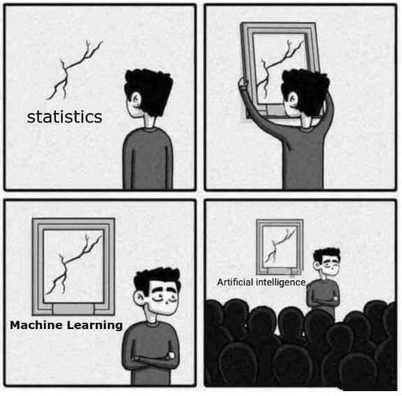 

> "Когда вы хотите получить финансирование, это искусственный интеллект. Когда вы составляете резюме, это ML. Когда дело доходит до реальной работы, это логистическая регрессия."
> 
> -- все, кто когда-либо заходил в Twitter

Традиционное программирование vs Машинное обучение
==================================================

<!-- data-type="none" -->
| Традиционное программирование | Машинное обучение |
| -------- | ------- |
| 1. Постановка задачи | 1. Постановка задачи |
| 2. Разработка правил, описывающих решение (самостоятельная разработка алгоритма решения) | 2. Алгоритм решения получается в результате обучения ML алгоритма на данных |
| 3. Оценивание алгоритма | 3. Оценивание алгоритма |
| 4. Анализ ошибок | 4. Анализ ошибок |
| 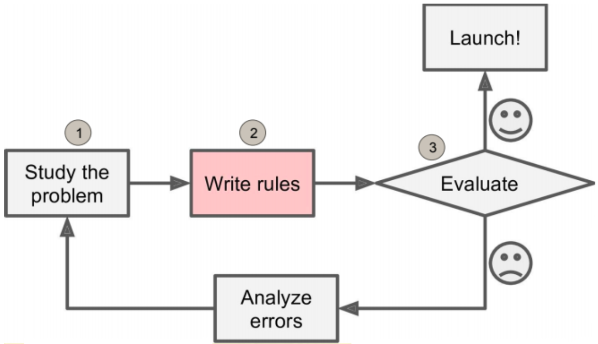 | 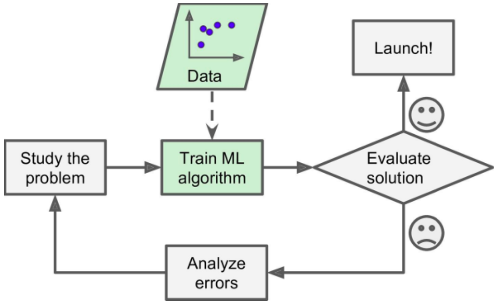 |
| [[ (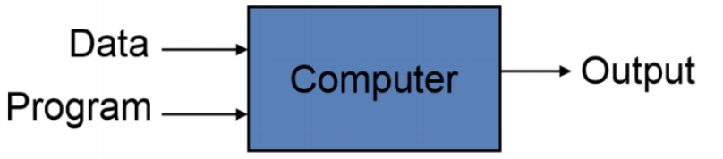) | 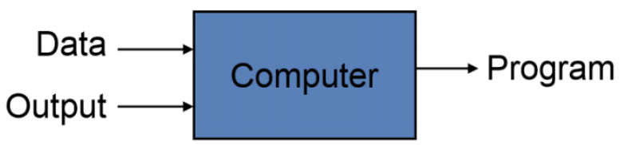 ]] | [[  | () ]]  |
| С новыми данными возникает множество исключений из существующих правил => приходится формулировать новые правила и следить, чтобы они не противоречили уже отлаженным существующим правилам. Для сложных задач будет длинный список сложных правил, которым сложно управлять. | Применяется для задач, которые слишком сложны для традиционных подходов или не имеют известных алгоритмов решения. |

-----------------------
Подходы к моделированию
=======================

**Подходы к моделированию:**

- Model based (по известным законам и правилам)

  - Более надежный подход, результат работы на новых данных более предсказуем 

- Data-driven (по данным)

  - Точная математическая модель отсутствует или недопустимо сложна
  - Наличие выборки типа“ вход-выход” для моделируемой системы
  - Алгоритм обработки данных неизвестен и формируется *в результате обучения*

**Сопоставьте задачи с подходами к моделированию:**

- [(Data-driven) (Model-based)]
- [    (x)           ( )]  Предсказание спроса на товары.
- [    ( )           (x)]  Моделирование движения планет.
- [    (x)           ( )]  Классификация изображений.
- [    ( )           (x)]  Расчет траектории полета ракеты.

**Соотношение интерпретируемость-точность:**

- Black box model (точные, сложно интерпритируемые)
- White box model (менее точные, легко интерпритируемые)

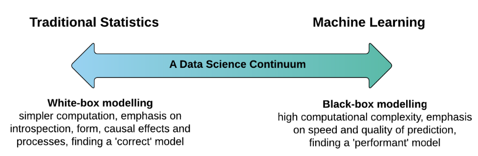

**Соотнесите модели:**

- [(Black box model) (White box model)]
- [    ( )           (x)]  Линейная регрессия
- [    (x)           ( )]  Ансамбли
- [    (x)           ( )]  Нейронные сети
- [    ( )           (x)]  Деревья решений

--------------
Пайплайн МО
===========

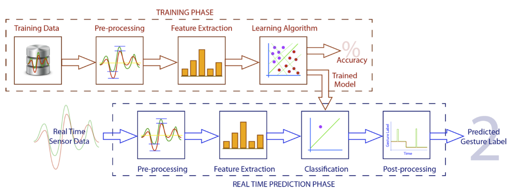

1. Фаза обучения

    1. Предобработка обучающих данных
    2. Выделение признаков
    3. Алгоритм обучения
    4. Оценка модели

2. Фаза использования

    1. Предобработка тестовых данных 
    2. Выделение признаков
    3. Использование обученной модели на тестовых данных
    4. Постобработка

Функция выделения признаков для тестовых данных **должна** совпадать с функцией выделения признаков для обучающих данных?

[(x)] да
[( )] нет

-------------------
Инженерия признаков
===================

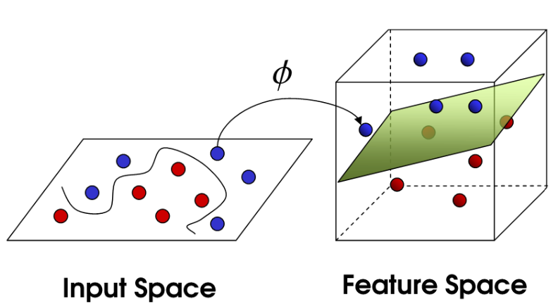

**Инженерия признаков** - подраздел машинного обучения, занимающийся формированием признаков.

Хорошие признаки означают:

- Гибкость
- Более простые модели
- Более точные и интерпретируемые результаты

Лучше выбрать хорошие признаки и использовать простую ML модель, чем пытаться обучить сложные ML модели на плохих признаках.

---------------------------
Оценивание точности моделей
===========================

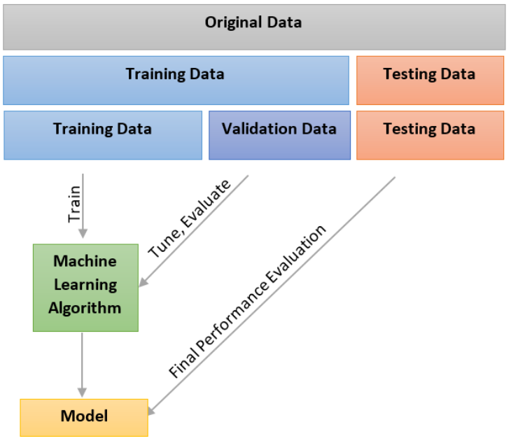

Для оценки точности датасет разбивается на несколько частей: 

- Обучающие данные

  - Обучающая выборка (для подстройки параметров модели)
  - Валидационная выборка (для корректировки процедуры обучения)
- Тестовая выборка (для оценки точности модели на новых для нее данных)

Для оценки точности модели необходимо найти среднее значение и дисперсию ошибки.
Для этого модель обучается несколько раз на разных данных (изначальные данные разбиваются определенным образом).
Этот метод называется **cross validation (кросс-валидация)**.

------------
Парадигмы МО
============

- Обучение с учителем (Supervised learning)
- Обучение без учителя (Unsupervised learning)
- Обучение с подкреплением (Reinforcement learning)
- Обучение ансамблей (Ensemble learning)
- Обучение с частичным привлечением учителя (Semi-supervised learning)
- Активное обучение (Active learning)
- Глубокое обучение (Deep learning)
- Трансферное обучение (Transfer learning)

------------------------------
</dev>

### Обучение с учителем

<dev style="font-family: Arial, sans-serif; font-size:14px;"> 

-----------------

Задачи обучения с учителем (Supervised Learning) связаны с моделированием определенной зависимости между входными и выходными данными. Исходные данные представляют собой пары "вход-выход", где каждый обучающий пример состоит из вектора $x$ (размерности $k$) и соответствующего ему вектора $y$ (размерности $m$). 

**Цель:** 

- построение модели, способной аппроксимировать зависимость $y$ как функцию от $x$.

**Особенности задач:**

- вектор $x$ может иметь высокую размерность
- признаки могут быть как числовыми, так и категориальными

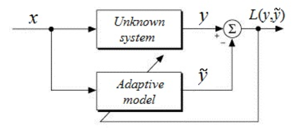Задача заключается в моделировании неизвестной функции *Unknown system*, которая преобразует $x$ в $y$. Входной вектор $x$ подается на модель *Adaptive model*, которая выдает предсказание $\tilde{y}$. Идеальным случаем является полное совпадение гиперповерхностей $y(x)$ и $\tilde{y}(x)$ в любой точке $x$, включая те, которые не представлены в обучающей выборке. Для оценки степени рассогласования между истинной функцией $y(x)$ и предсказанной функцией $\tilde{y}(x)$ используется **функция потерь** (Loss function) $L(y,\tilde{y})$.

**Задача обучения с учителем** заключается в минимизации среднего значения функции потерь на множестве обучающих примеров. Основное требование к модели состоит в том, чтобы она обеспечивала высокую точность аппроксимации на обучающей выборке.

Возникает вопрос: почему модель, обученная на ограниченном наборе данных, должна хорошо обобщаться на неизвестные данные, не входящие в обучающую выборку? Этот аспект требует дополнительного анализа и применения методов, направленных на улучшение обобщающей способности модели.

-----------------
Постановка задачи
=================

**Дано**:

$$D = \{ (x^{(1)}, y^{(1)}), ... , (x^{(n)}, y^{(n)}) \}$$

$x^{(i)} \in X, y^{(i)} \in Y, i=\overline{1,n}$  -- исходные данные типа вход-выход

**Критерий**:

$$R^*=\frac{1}{n}\sum_{i=1}^{n}{Loss(y^{(i)}, \tilde{y}^{(i)})}\rightarrow \min_{w}$$

$\tilde{y}^{(i)}$ - выход модели для входа
  
$x^{(i)}$ , $i=\overline{1, n}$  

$w$ -- вектор параметров модели

$Loss$ -- функция потерь

**Найти**:

Вектор $w^*$, минимизирующий $R^*$

----
Типы задач
==========

| Классификация | Регрессия |
| -------- | -------: |
| $D = \{ (x^{(1)}, y^{(1)}), ... , (x^{(n)}, y^{(n)}) \}$ | $D = \{ (x^{(1)}, y^{(1)}), ... , (x^{(n)}, y^{(n)}) \}$|
| $x^{(i)} \in X$ – i-й образец, | $x^{(i)} \in X$ – i-й образец,|
| $i=\overline{1,n}$ | $i=\overline{1,n}$ |
| $y^{(i)} \in Y$, [[ отклик для | (метка образца) ]] $x^{(i)}$ | $y^{(i)} \in Y$, [[ (отклик для) | метка образца ]] $x^{(i)}$ |
| [[ ($Y = \{1,...,K\}$) | $Y = \mathbb{R}^L$ ]] – множество [[ откликов | (меток) ]] | [[ $Y = \{1,...,K\}$ | ($Y = \mathbb{R}^L$) ]] – множество [[ (откликов) | меток ]] |
|  | 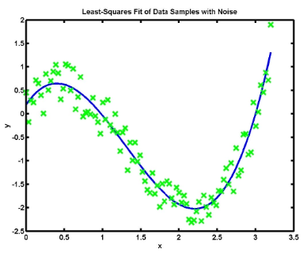 |

----
Подходы
=======

- Линейная регрессия
- Логистическая регрессия
- Байесовские методы
- Методы на основе соседства
- Метод опорных векторов
- Деревья решений
- Нейронные сети
- ...

----

</dev>

### Обучение без учителя

<dev style="font-family: Arial, sans-serif; font-size:14px;"> 

-----------------

**Обучение без учителя** (Unsupervised Learning), или самообучение, представляет собой класс методов машинного обучения, в которых модель строится на основе данных, содержащих *только* входные признаки, без явно заданных целевых переменных (выходов). 

**Цель:**

- анализ структуры данных
- выявление скрытых закономерностей
- представлении данных в более информативном виде

**Особенности задач:**

- Отсутствие явных меток или целевых переменных затрудняет оценку точности обучения, так как не существует эталонного выхода, с которым можно было бы сравнивать результаты работы модели.

- Результаты обучения часто интерпретируются субъективно, в зависимости от поставленной задачи и выбранных критериев.

-----------------
Постановка задачи
=================

**Дано**:

$$D = \{ x^{(1)}, ... , x^{(n)} \}$$

$x^{(i)} \in X, i=\overline{1, n}$ - входы модели

**Найти:**

  Лучшее представление для $D$, оценить распределения, обнаружить выбросы, найти паттерны и т.д.

 

----------
Типы задач
==========

**Кластеризация данных**

- Разбиение данных на группы (кластеры), где объекты внутри одного кластера близки друг к другу по определенному критерию, а объекты из разных кластеров существенно различаются. Сложности:

  - Разнообразие критериев оценки качества кластеризации.
  - Неочевидность выбора оптимального числа кластеров.

 

**Восстановление пропущенных данных**

- На вход алгоритма подаются данные с пропущенными значениями, а на выходе получаются данные с восстановленными значениями. Методы восстановления могут основываться на статистических закономерностях или структуре данных.

**Сокращение размерности**

- Уменьшение числа признаков в данных при сохранении их информативности.

**Детекция аномалий**

- Выявление объектов, которые существенно отличаются от основной массы данных. Такие объекты могут быть вызваны ошибками в данных или представлять собой редкие, но важные события. 

-------
Подходы
=======

- Кластерный анализ
- Самоорганизующиеся карты (SOM)
- Анализ главных компонентов (PCA)
- Анализ независимых компонентов (ICA)
- Многомерное шкалирование (MDS)
- Стохастическое вложение соседей (t-SNE)
- ...

------------------
**В чем ключевое различие между Supervised и Unsupervised Learning?**

<!-- data-randomize -->
[( )] В Supervised Learning данные всегда имеют числовой формат, а в Unsupervised Learning данные могут быть категориальными.  
[(x)] В Supervised Learning требуется наличие размеченных данных, а в Unsupervised Learning данные не требуют разметки.  
[( )] В Supervised Learning используются только линейные модели, а в Unsupervised Learning -- нелинейные.  
[( )] В Supervised Learning данные всегда имеют низкую размерность, а в Unsupervised Learning -- высокую. 

-----------

</dev>

### Обучение с частичным привлечением учителя

<dev style="font-family: Arial, sans-serif; font-size:14px;"> 

-----------------

**Обучение с частичным привлечением учителя** (Semi-supervised Learning) представляет собой подход, при котором используются как размеченные (labeled), так и неразмеченные (unlabeled) данные.

Как правило, объем неразмеченных данных значительно превышает объем размеченных, поскольку процесс разметки данных требует значительных временных и ресурсных затрат.

-----------------
Постановка задачи
=================

**Дано**:

Размеченная выборка:

$$ D_L = \{ (x^{(1)}, y^{(1)}), ... , (x^{(n_L)}, y^{(n_L)}) \}$$

$x^{(i)} \in X, i=\overline{1,n}$

$y^{(i)} \in Y, i=\overline{1,n_L}$

$Y={1,...,K}$ – множество меток класса

Неразмеченная выборка:
$$ D_U = \{ x^{(n_L+1)}, ... , x^{(n_L+n_U)} \}$$

$n_L \ll n_U$

$x^{(n_L+i)} \in X, \ i=\overline{1, n_U}$

**Задачи:**

- **Построить алгоритм классификации**, используя как размеченные, так и неразмеченные данные.

- **Разметить данные из $D_U$ (трансдуктивное обучение)**. Акцент делается не на обобщающую способность модели (т.е. способность работать на любых неизвестных данных), а на точность классификации конкретной неразмеченной выборки. 

------
**Различие Semi-supervised и Supervised:** 

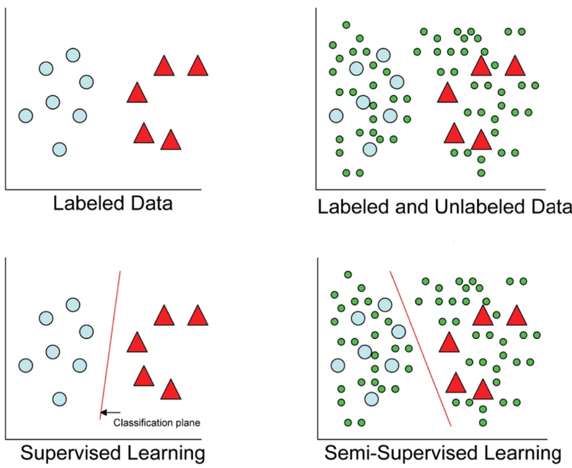 Неразмеченные данные помогают улучшить качество классификации, т.к. при обучении делается неявное предположение: данные, близкие к размеченным данным какого-либо класса, с высокой вероятностью относятся к тому же классу.

**Различие Semi-supervised и Unsupervised:** 

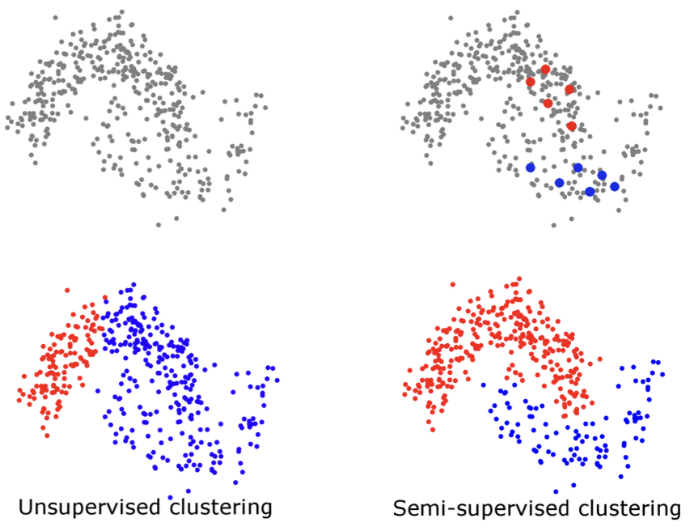 Наличие некоторых размеченных данных может изменить разделение на кластеры, т.к. при обучении делается неявное предположение: данные с одинаковыми метками относятся к одному и тому же кластеру.

-----

</dev>

### Обучение ансамблей

<dev style="font-family: Arial, sans-serif; font-size:14px;">

**Обучение ансамблей** моделей (Ensemble Learning) представляет собой подход, при котором несколько моделей комбинируются для повышения точности и устойчивости предсказаний. 

-----------------
Постановка задачи
=================

**Дано**:
$$ D = \{ (x^{(1)}, y^{(1)}), ... , (x^{(n)}, y^{(n)}) \} $$

$x^{(i)} \in X, i=\overline{1,n}$

$y^{(i)} \in Y, i=\overline{1,n},\ Y = \{1, ..., K\}$ – метки классов

$h_1, ...h_L$ — базовые классификаторы (гипотезы)

$h = h_1\ ∘\ ...\ ∘\ h_L$

--------
Подходы:
========

- Байесовское голосование
- Манипулирование с обучающей выборкой

  - Кросс-валидационные комитеты
  - Бэггинг
  - Бустинг
- Манипулирование с признаками
- Манипулирование с откликами

Алгоритмы:
==========

- Голосующие классификаторы
- AdaBoost
- Случайные леса
- Рандомизированные деревья
- ...

</dev>

### Обучение с подкреплением

<dev  style="font-family: Arial, sans-serif; font-size:14px;">

----------

**Обучение с подкреплением** (Reinforcement Learning) принципиально отличается от других подходов машинного обучения, таких как обучение с учителем или без учителя. Вместо обучающей выборки рассматривается **агент**, который взаимодействует со средой, обучаясь на основе получаемой обратной связи в виде наград (поощрений) или штрафов (наказаний).

**Задача агента** – действовать в среде, чтобы максимизировать долговременный выигрыш.

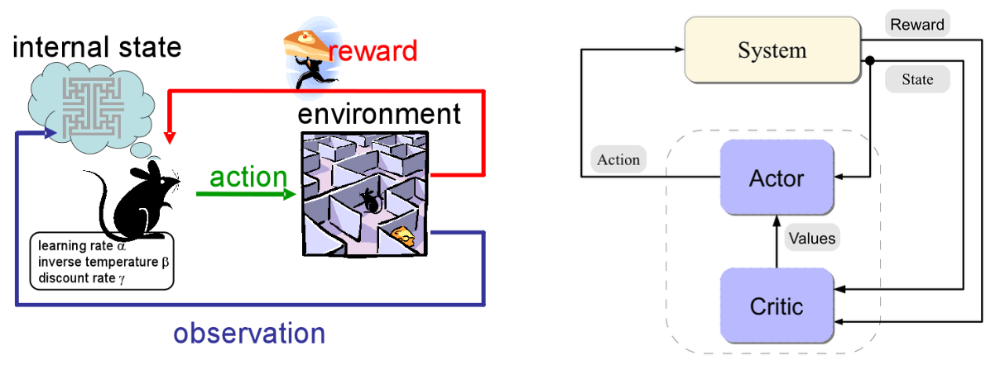

Представь, что ты агент в задаче обучения с подкреплением. Какое действие ты бы выбрал, чтобы получить долговременный выигрыш?

[( )] Пойти пить пиво🍺
[(x)] Посмотреть лекцию по машинному обучению👨‍💻

-------------------

</dev>

### Активное обучение

-------------------
<dev style="font-family: Arial, sans-serif; font-size:14px;">

**Активное обучение** – одна из разновидностей обучения с частичным привлечением учителя, в которой обучающий алгоритм интерактивно запрашивает у пользователя (или информационной системы) желаемый выход для некоторых неразмеченных данных. 

В статистической литературе активное обучение известно как **оптимальное планирование эксперимента.**

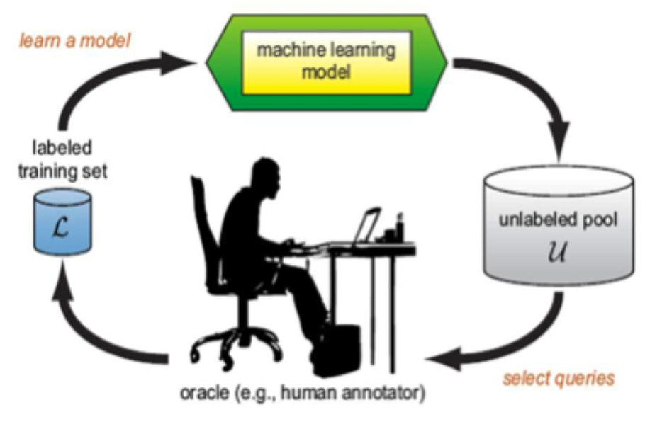 

--------

</dev>

### Глубокое обучение
-------------------
<dev  style="font-family: Arial, sans-serif; font-size:14px;">

**Глубокое обучение** (обучение иерархиям) – часть более широкого семейства методов машинного обучения, основанных на *обучении представлениям* (feature learning), в противоположность задачно-ориентированным алгоритмам.

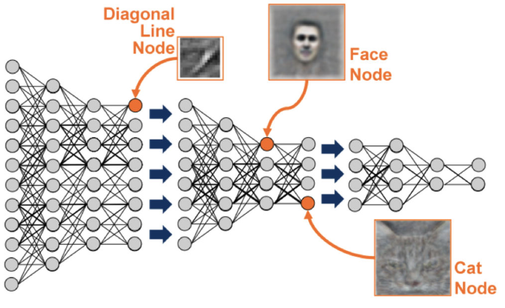 

**Архитектура:**

- Последний слой сети решает задачу классификации или регрессии.
- Предыдущие слои автоматически формируют иерархические признаки, моделируя знания эксперта.

**Преимущества:**

- Устранение необходимости в дорогостоящих экспертах, формирующих признаки.
- Возможность решать задачи, которые сложно формализовать.

**Недостатки:**

- Низкая интерпретируемость результатов (непонятно, по каким признакам сеть принимает решения).

**Методы:**

- Сверточные нейронные сети (CNN)
- Сети глубокого доверия (DBN)
- Глубокие машины Больцмана
- Глубокие рекуррентные нейронные сети 

-----
**Машинное обучение vs Глубокое обучение.**

| Машинное обучение | Глубокое обучение |
| ---- | ---- |
| [[(Ручное создание признаков (feature extraction)) | Обучение признаков (feature learning)]] | [[Ручное создание признаков (feature extraction) | (Обучение признаков (feature learning))]] |
| [[(Наличие) | Отсутствие]]  экспертов по формированию признаков | [[Наличие | (Отсутствие)]]  экспертов по формированию признаков  |
| [[(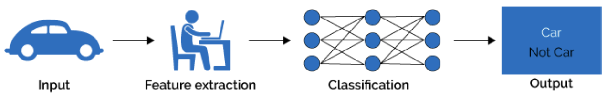) | 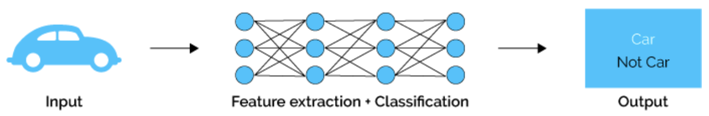]] | [[ | ()]] |

**Что означает термин "глубокое"?**

<!-- data-randomize -->
[[x]] Использование многослойных архитектур.
[[x]] Нейроны в слоях организованы в многомерные структуры (карты), а не в линейные последовательности.
[[ ]] Более глубокий анализ данных.

**Почему глубокое обучение так популярно в последние годы?**

<!-- data-randomize -->
[( )] Появление принципиально новых идей, которые радикально изменили подход к машинному обучению.
[(x)] Развитие технологий, таких как GPU и TPU, и доступность больших объемов данных, что позволило реализовать ранее существовавшие концепции.

**Что оказывает наибольшее влияние на качество обученной модели?**

<!-- data-randomize -->
[( )] Выбор алгоритма машинного обучения.
[(x)] Качество и релевантность признаков, используемых для обучения.
[( )] Объем вычислительных ресурсов, доступных для обучения.
[( )] Количество слоев в нейронной сети.

**В каких случаях глубокое обучение требует наличия размеченных данных (меток)?**

<!-- data-randomize -->
[( )] Всегда, так как глубокое обучение основано на обучении с учителем.
[( )] Никогда, так как глубокое обучение использует только неразмеченные данные.
[(x)] Только при решении задач классификации или регрессии, где требуется обучение с учителем.
[( )] Только при использовании сверточных нейронных сетей.

-------------
</dev>

### Трансферное обучение
-------------------
<dev style="font-family: Arial, sans-serif; font-size:14px;">

Трансферное обучение (Transfer Learning), или перенос знаний, – область машинного обучения, занимающаяся методами применения знаний, полученных в результате решения одной задачи, к другим задачам. 

Трансферное обучение требует [[больше | (меньше)]] данных и ресурсов, чем обучение с нуля.

При трансферном обучении изменяются [[все |(только последние, отвечающие за классификацию)| только начальные, отвечающие за извлечение признаков]] слои предобученной глубокой нейронной сети.

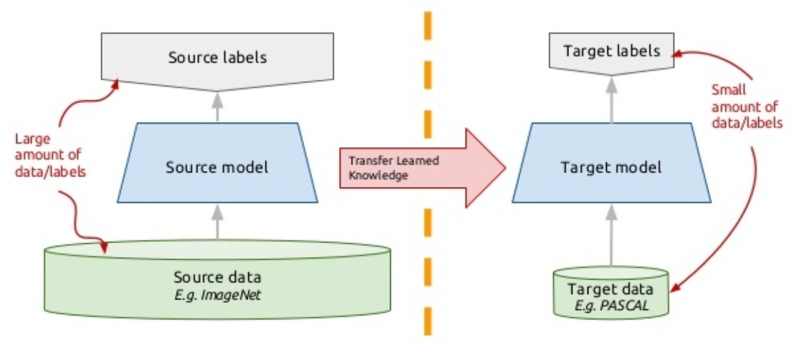

-------------

</dev>

### Тест
-------------
<dev style="font-family: Arial, sans-serif; font-size:14px;">
**1. Что изучает машинное обучение?**

<!-- data-randomize -->
[[x]] Методы решения задач с использованием обучающих данных.
[[ ]] Методы создания баз данных.
[[ ]] Методы разработки игр.
[[ ]] Методы создания операционных систем.

**2. Какой подход к моделированию основан на известных законах и правилах?**

<!-- data-randomize -->
[[ ]] Data-driven
[[x]] Model-based
[[ ]] Black box model
[[ ]] White box model

**5. Какой этап пайплайна машинного обучения включает предобработку данных?**

<!-- data-randomize -->
[[x]] Фаза обучения
[[x]] Фаза использования
[[ ]] Оценка алгоритма
[[ ]] Выбор данных

**6. Сопоставьте подходы к моделированию с их описаниями:**

**Сопоставьте задачи с подходами к моделированию:**

<!-- data-randomize -->
- [(Data-driven) (Model-based) (Black box model) (White box model)]
- [ (x) ( ) ( ) ( )]  Модели, которые обучаются на данных.
- [ ( ) ( ) (x) ( )]  Точные, но сложно интерпретируемые модели.
- [ ( ) (x) ( ) ( )]  Модели, основанные на известных законах и правилах.
- [ ( ) ( ) ( ) (x)]  Менее точные, но легко интерпретируемые модели.

------------------

</dev>
