<!--

author:     Alexander Trofimov
attribute:  **Editor:** Daria Gudkova
email:    
date:       21/02/2025
version:    0.1
language:   en
narrator:   English

repository: https://github.com/dpocloud/ml_intro

icon:    ./logo_mephi2.png
logo:    ./logo_ml_intro.png

comment:  Курс "Введение в машинное обучение"

script:   https://cdn.jsdelivr.net/chartist.js/latest/chartist.min.js
          https://felixhao28.github.io/JSCPP/dist/JSCPP.es5.min.js

link:     https://cdn.jsdelivr.net/chartist.js/latest/chartist.min.css

link:     https://cdnjs.cloudflare.com/ajax/libs/animate.css/4.1.1/animate.min.css

import:   https://raw.githubusercontent.com/liaScript/rextester_template/master/README.md

link:     ./custom.css

import:   ./macro.md

-->

** **<!-- ======================================================================================  -->
** **<!-- Страница курса  -->

# Введение в машинное обучение
-----

<h3 style="text-align: center;">Добро пожаловать на курс **"Введение в машинное обучение"**!</h3>

Машинное обучение - подраздел искусственного интеллекта, изучающий методы построения моделей и алгоритмов, способных обучаться. Методы машинного обучения используются при решении широкого круга прикладных задач, для которых разработка явного алгоритма решения затруднительна или невозможна. И этот круг задач постоянно расширяется. Повсеместная информатизация приводит к накоплению огромных объёмов данных в науке, производстве, бизнесе, транспорте, здравоохранении.

В курсе рассматриваются основные принципы машинного обучения с учителем, изучаются постановки задач регрессии и классификации и используемые для их решения модели и методы обучения, а также оценки качества обученных моделей, рассматриваются особенности организации процесса обучения с учителем и применения методов машинного обучения для решения практических задач. Изложение ведется строгим математическим языком, сопровождается множеством формул и математических выкладок.

Учебный курс ставит также своей целью приобретение умений ставить практические задачи в терминах машинного обучения, освоение студентами практических приемов построения моделей машинного обучения и оценки их качества. Выполняемые студентами задания позволяют получить практический опыт по созданию и экспериментальному исследованию свойств обучающихся моделей и методов обучения.

-----
<h3 style="text-align: center;">Разделы курса</h3>

1. Введение в машинное обучение
2. Основные парадигмы машинного обучения
3. Обучение с учителем: основные принципы
4. Обучение с учителем: регрессия
5. Диагностика регрессионных моделей
6. Бинарная классификация
7. Многоклассовая классификация
8. Байесовская классификация
9. Логистическая регрессия

-----
 
| | |
| **Продолжительность курса** | 48 ак.ч. |
| **Автор(ы)** | к.т.н., доцент Трофимов Александр Геннадьевич |
| **Верстка** | Гудкова Дарья, Трофимов Александр Геннадьевич |
| **Версия** | 0.1 |
| **Дата изменения** | март 2025 г. |

[qr-code](https://LiaScript.github.io)

-----

😀⭐

** **<!-- ======================================================================================  -->
** **<!-- Страница раздела  -->

## Введение в машинное обучение
-----

!?[The Future of Programming](https://www.youtube.com/watch?v=8pTEmbeENF4)

<h3 style="text-align: center;">Содержание раздела</h3>

- Что такое машинное обучение?
- Data-driven и model-based подходы
- Пайплайн машинного обучения
- Основные парадигмы машинного обучени

  - Обучение с учителем
  - Обучение без учителя
  - Обучение с частичным привлечением учителя
  - Обучение ансамблей
  - Обучение с подкреплением
  - Активное обучение
  - Глубокое обучение
  - Трансферное обучение

-----

### Что такое машинное обучение?
-----

**Машинное обучение** -- область прикладной математики, изучающая методы решения задач с использованием *обучающих данных*.

> "Machine learning is field of study that gives computers the ability to learn without being explicitly programmed."
> 
> -- Arthur Samuel, in IBM Journal of Research and Development, 1959

Машинное обучение и математическая статистика
-----

@img01(MLMSAI.png, Машинное обучение и статистика, 50)

> "Когда вы хотите получить финансирование, это искусственный интеллект. Когда вы составляете резюме, это ML. Когда дело доходит до реальной работы, это логистическая регрессия."
> 
> -- все, кто когда-либо заходил в Twitter

Машинное обучение и искусственный интеллект
-----

@img01(ai1.png, Машинное обучение и ИИ, 75)

Когда мы говорим об ИИ, мы имеем в виду машинное обучение и глубокое обучение.

### Data-driven и model-based подходы
-----

Традиционное программирование vs машинное обучение
-----

| | |
| **Традиционное программирование** | **Машинное обучение** |
| 1. Постановка задачи | 1. Постановка задачи |
| 2. Разработка правил, описывающих решение (ручная разработка алгоритма решения задачи) | 2. Алгоритм решения задачи получается в результате обучения ML-алгоритма на данных |
| 3. Оценивание алгоритма | 3. Оценивание алгоритма |
| 4. Анализ ошибок | 4. Анализ ошибок |
| @img01(TraditionalApproache.png, Алгоритм традиционного программирования, 100) | @img01(MLApproache.png, Алгоритм ML, 100) |
| @img01(TradApp.png, Схема традиционного программирования, 100) | @img01(MLApp.png, Схема ML, 100) |
| С новыми данными возникает множество исключений из существующих правил => приходится формулировать новые правила и следить, чтобы они не противоречили уже отлаженным существующим правилам. Для сложных задач будет длинный список сложных правил, которым сложно управлять. | Применяется для задач, которые слишком сложны для традиционных подходов или не имеют известных алгоритмов решения. |

---

Подходы к моделированию
-----

| | |
| **Model-based** | **Data-driven** |
| Ручное построение математических моделей, используя известные физические, экономические и другие законы, а также экспертные правила | Автоматическое построение моделей в результате обучения на выборках данных |
| Более надежный, результат работы на новых данных более предсказуем | Низкая интерпретируемость модели, результат работы на новых данных непредсказуем |
| White-box model | White-box model или black-box model |

**Особенности data-driven подхода**

- Точная математическая модель отсутствует или недопустимо сложна
- Наличие выборки типа“ вход-выход” для моделируемой системы
- Алгоритм обработки данных неизвестен и формируется *в результате обучения*

Традиционная статистика vs машинное обучение
-----

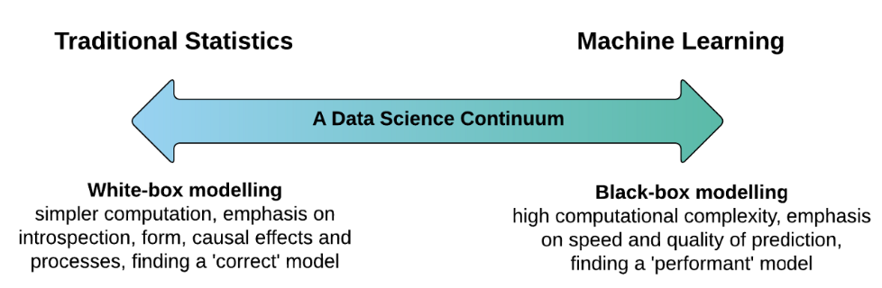

### Пайплайн машинного обучения
-----

- **Фаза обучения**

    1. Предобработка обучающих данных
    2. Выделение признаков
    3. Алгоритм обучения
    4. Оценка модели

- **Фаза использования**

    1. Предобработка тестовых данных 
    2. Выделение признаков
    3. Использование обученной модели на тестовых данных
    4. Постобработка

Инженерия признаков
-----

**Инженерия признаков** -- подраздел машинного обучения, изучающий способы формирования представлений выборочных данных для решения задач машинного обучения

Хорошие признаки означают:

- Гибкость
- Более простые модели
- Лучшие результаты

Лучше выбрать хорошие признаки и использовать простую ML модель, чем пытаться обучить сложные ML модели на плохих признаках.

Оценивание точности моделей
-----

Как мы можем получить объективную оценку точности обученной модели?

Для оценки точности датасет разбивается на несколько частей: 

- Обучающие данные

  - Обучающая выборка (для подстройки параметров модели)
  - Валидационная выборка (для корректировки процедуры обучения)

- Тестовая выборка (для оценки точности модели на новых для нее данных)

### Основные парадигмы машинного обучени
-----

- Обучение с учителем (Supervised learning)
- Обучение без учителя (Unsupervised learning)
- Обучение с частичным привлечением учителя (Semi-supervised learning)
- Обучение ансамблей (Ensemble learning)
- Активное обучение (Active learning)
- Обучение с подкреплением (Reinforcement learning)
- Глубокое обучение (Deep learning)
- Трансферное обучение (Transfer learning)

Задачи машинного обучения
-----

#### Обучение с учителем
-----

Задачи **обучения с учителем (Supervised Learning)** связаны с моделированием определенной зависимости между входными и выходными данными. Исходные данные представляют собой пары "вход-выход", где каждый обучающий пример состоит из вектора $x$ (размерности $k$) и соответствующего ему вектора $y$ (размерности $m$). 

**Цель:** построение модели, способной аппроксимировать зависимость $y$ как функцию от $x$.

**Особенности задач:**

- вектор $x$ может иметь высокую размерность
- признаки могут быть как числовыми, так и категориальными

Задача заключается в моделировании неизвестной функции, реализуемой некоторой системой *Unknown system*, которая преобразует $x$ в $y$. Входной вектор $x$ подается на модель *Adaptive model*, которая выдает предсказание $\tilde{y}$. Идеальным случаем является полное совпадение гиперповерхностей $y(x)$ и $\tilde{y}(x)$ в любой точке $x$, включая те, которые не представлены в обучающей выборке.

Для оценки степени рассогласования между истинной функцией $y(x)$ и предсказанной функцией $\tilde{y}(x)$ используется **функция потерь** (Loss function) $L(y,\tilde{y})$.

**Задача обучения с учителем** заключается в минимизации среднего значения функции потерь на множестве обучающих примеров. Основное требование к модели состоит в том, чтобы она обеспечивала высокую точность аппроксимации на обучающей выборке.

**Возникает вопрос:** почему модель, обученная на ограниченном наборе данных, должна хорошо обобщаться на неизвестные данные, не входящие в обучающую выборку? Этот аспект требует дополнительного анализа и применения методов, направленных на улучшение обобщающей способности модели.

Постановка задачи обучения с учителем
-----

**Дано**:

$$D = \{ (x^{(1)}, y^{(1)}), ... , (x^{(n)}, y^{(n)}) \},$$

где $x^{(i)} \in X, y^{(i)} \in Y, i=\overline{1,n}$  -- исходные данные типа вход-выход.

**Критерий**:

$$R^*=\frac{1}{n}\sum_{i=1}^{n}{Loss(y^{(i)}, \tilde{y}^{(i)})}\rightarrow \min_{w},$$

где $\tilde{y}^{(i)}$ - выход модели для входа, $x^{(i)}$ , $i=\overline{1, n}$, $w$ -- вектор параметров модели, $Loss$ -- функция потерь.

**Найти**:

Вектор $w^*$, минимизирующий эмпирической риск $R^*$

Типы задач
-----

| | | |
| | **Классификация** | **Регрессия** |
| Обучающая выборка | $D = \{ (x^{(1)}, y^{(1)}), ... , (x^{(n)}, y^{(n)}) \}$ | $D = \{ (x^{(1)}, y^{(1)}), ... , (x^{(n)}, y^{(n)}) \}$|
| Входные образцы | $x^{(i)} \in X$ – $i$-й образец,  $i=\overline{1,n}$ | $x^{(i)} \in X$ – $i$-й образец,  $i=\overline{1,n}$ |
| Множество откликов | $y^{(i)} \in Y$, $Y = \{1,...,K\}$ | $y^{(i)} \in Y$, $Y = \mathbb{R}^L$ |
| Иллюстрация | 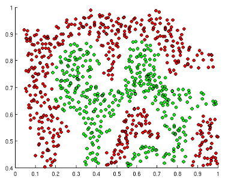 | 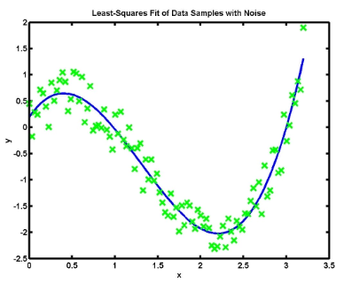 |

Методы машинного обучения с учителем
-----

- Линейная регрессия
- Логистическая регрессия
- Байесовские методы
- Методы на основе соседства
- Метод опорных векторов
- Деревья решений
- Нейронные сети
- ...

#### Обучение без учителя
-----

**Обучение без учителя (Unsupervised Learning), или самообучение**, представляет собой класс методов машинного обучения, в которых модель строится на основе данных, содержащих *только* входные признаки, без явно заданных целевых переменных (выходов). 

**Задачи машинного обучения без учителя:**

- анализ структуры данных
- выявление скрытых закономерностей
- представлении данных в более информативном виде

**Особенности задач:**

- отсутствие явных меток или целевых переменных затрудняет оценку точности обучения, так как не существует эталонного выхода, с которым можно было бы сравнивать результаты работы модели
- результаты обучения часто интерпретируются субъективно, в зависимости от поставленной задачи и выбранных критериев

Постановка задачи машинного обучения без учителя
-----

**Дано**:

$$D = \{ x^{(1)}, ... , x^{(n)} \},$$

гд $x^{(i)} \in X, i=\overline{1, n}$ - входы модели

**Найти:**

Лучшее представление для $D$, оценить распределения, обнаружить выбросы, найти паттерны и т.д.

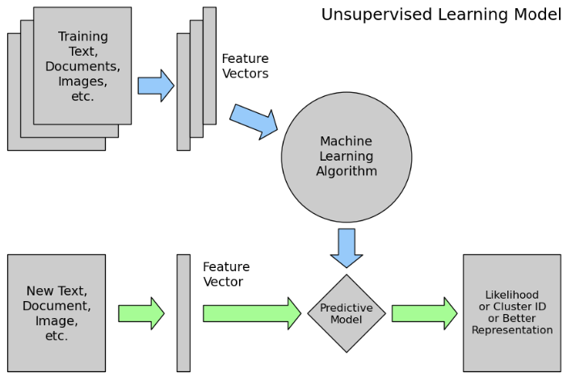

Типы задач машинного обучения без учителя
-----

**Кластеризация данных**

- Разбиение данных на группы (кластеры), где объекты внутри одного кластера близки друг к другу по определенному критерию, а объекты из разных кластеров существенно различаются. 

Сложности: разнообразие критериев оценки качества кластеризации, неочевидность выбора оптимального числа кластеров.

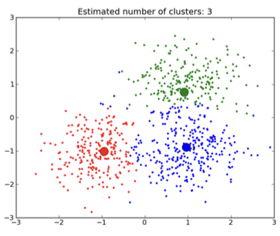

**Восстановление пропущенных данных**

- На вход алгоритма подаются данные с пропущенными значениями, а на выходе получаются данные с восстановленными значениями. Методы восстановления могут основываться на статистических закономерностях или структуре данных.

**Сокращение размерности**

- Уменьшение числа признаков в данных при сохранении их информативности.

**Детекция аномалий**

- Выявление объектов, которые существенно отличаются от основной массы данных. Такие объекты могут быть вызваны ошибками в данных или представлять собой редкие, но важные события. 

Подходы машинного обучения без учителя
-----

- Кластерный анализ
- Самоорганизующиеся карты (SOM)
- Анализ главных компонентов (PCA)
- Анализ независимых компонентов (ICA)
- Многомерное шкалирование (MDS)
- Стохастическое вложение соседей (t-SNE)
- ...

#### Обучение с частичным привлечением учителя
-----

**Обучение с частичным привлечением учителя (Semi-supervised Learning)** представляет собой подход, при котором используются как размеченные (labeled), так и неразмеченные (unlabeled) данные.

Как правило, объем неразмеченных данных значительно превышает объем размеченных, поскольку процесс разметки данных требует значительных временных и ресурсных затрат.

Постановка задачи обучения с частичным привлечением учителя
-----

**Дано**:

Размеченная выборка:

$$ D_L = \{ (x^{(1)}, y^{(1)}), ... , (x^{(n_L)}, y^{(n_L)}) \},$$

где $x^{(i)} \in X, i=\overline{1,n}$, $y^{(i)} \in Y, i=\overline{1,n_L}$, $Y={1,...,K}$ – множество меток класса.

Неразмеченная выборка:
$$ D_U = \{ x^{(n_L+1)}, ... , x^{(n_L+n_U)} \},$$

где $n_L \ll n_U$, $x^{(n_L+i)} \in X, \ i=\overline{1, n_U}$.

**Задачи машинного обучения с частичным привлечением учителя:**

- **Построить алгоритм классификации**, используя как размеченные, так и неразмеченные данные.

- **Разметить данные из $D_U$ (трансдуктивное обучение)**. Акцент делается не на обобщающую способность модели (т.е. способность работать на любых неизвестных данных), а на точность классификации конкретной неразмеченной выборки. 

Отличия от обучения с учителем и без учителя
------

**Отличие semi-supervised от supervised** 

 Неразмеченные данные помогают улучшить качество классификации, т.к. при обучении делается неявное предположение: данные, близкие к размеченным данным какого-либо класса, с высокой вероятностью относятся к тому же классу.

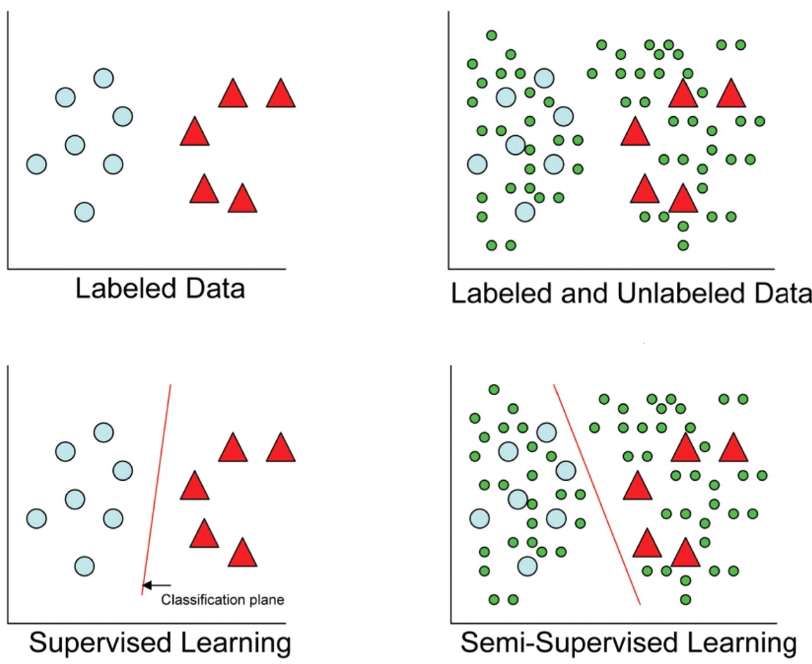

**Отличие semi-supervised и unsupervised** 

Наличие некоторых размеченных данных может изменить разделение на кластеры, т.к. при обучении делается неявное предположение: данные с одинаковыми метками относятся к одному и тому же кластеру.

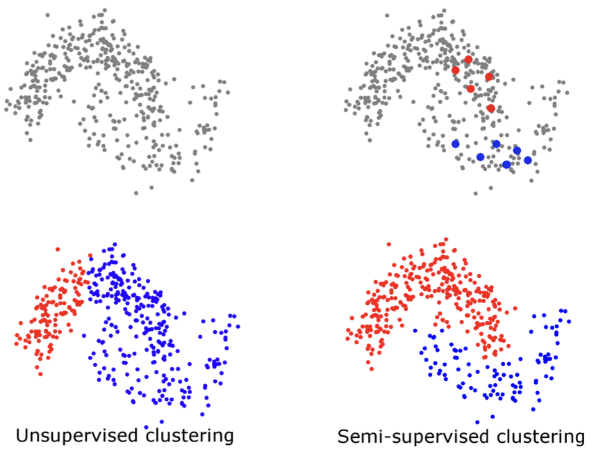

#### Обучение ансамблей
-----

**Обучение ансамблей (Ensemble Learning)** представляет собой подход, при котором несколько моделей комбинируются для повышения точности и устойчивости предсказаний.

Постановка задачи обучения ансамблей
-----

**Дано**:
$$ D = \{ (x^{(1)}, y^{(1)}), ... , (x^{(n)}, y^{(n)}) \},$$

где $x^{(i)} \in X, i=\overline{1,n}$, $y^{(i)} \in Y, i=\overline{1,n},\ Y = \{1, ..., K\}$ – метки классов, $h_1, ...h_L$ — базовые классификаторы (гипотезы), $h = h_1\ ∘\ ...\ ∘\ h_L$

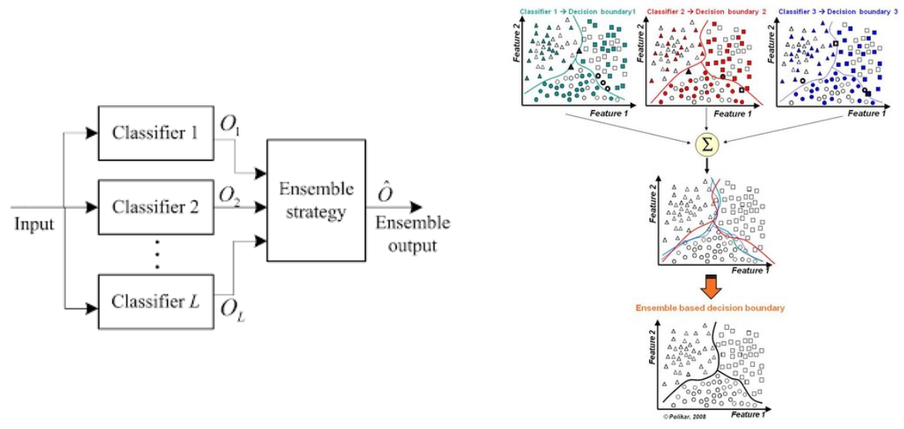

Подходы и модели обучения ансамблей
-----

**Подходы обучения ансамблей:**

- Байесовское голосование
- Манипулирование с обучающей выборкой

  - Кросс-валидационные комитеты
  - Бэггинг
  - Бустинг

- Манипулирование с признаками
- Манипулирование с откликами

 
**Модели обучения ансамблей:**

- Голосующие классификаторы
- AdaBoost
- Случайные леса
- Рандомизированные деревья
- ...

#### Обучение с подкреплением и активное обучение
-----

Обучение с подкреплением
-----

**Обучение с подкреплением (Reinforcement Learning)** принципиально отличается от других подходов машинного обучения, таких как обучение с учителем или без учителя. Вместо обучающей выборки рассматривается **агент**, который взаимодействует со средой, обучаясь на основе получаемой обратной связи в виде наград (поощрений) или штрафов (наказаний).

**Задача агента**: действовать в среде, чтобы максимизировать долговременный выигрыш.

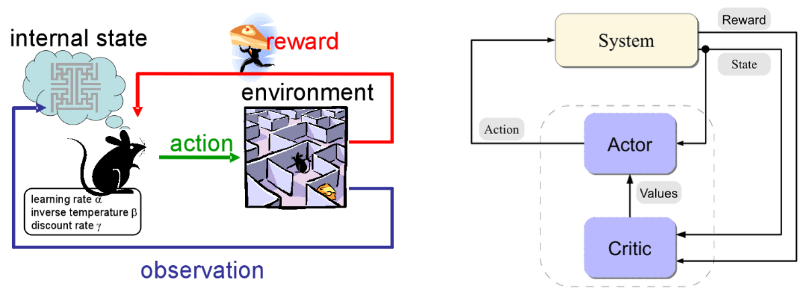

Активное обучение
-----

**Активное обучение** – одна из разновидностей обучения с частичным привлечением учителя, в которой обучающий алгоритм интерактивно запрашивает у пользователя (или информационной системы) желаемый выход для некоторых неразмеченных данных. 

В статистической литературе активное обучение известно как **оптимальное планирование эксперимента.**

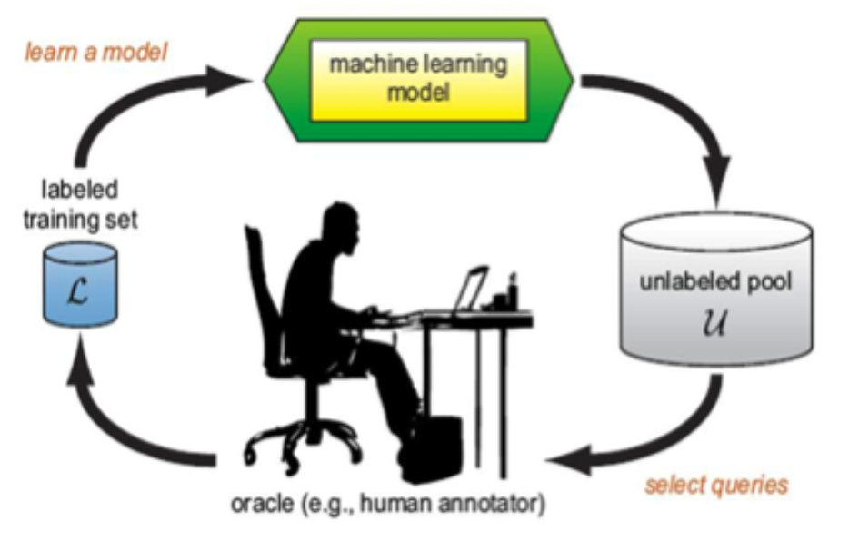

#### Глубокое обучение
-----

**Глубокое обучение** (обучение иерархиям) -- часть более широкого семейства методов машинного обучения, основанных на *обучении представлениям (feature learning)*, в противоположность задачно-ориентированным алгоритмам.

**Архитектура глубокой нейронной сети:**

- Последний слой сети решает задачу классификации или регрессии.
- Предыдущие слои автоматически формируют иерархические признаки, моделируя знания эксперта.

**Преимущества:** устранение необходимости в дорогостоящих экспертах, формирующих признаки; возможность решать задачи, которые сложно формализовать.

**Недостатки:** низкая интерпретируемость результатов (непонятно, по каким признакам сеть принимает решения).

**Модели глубокого обучения:**

- Сверточные нейронные сети (CNN)
- Сети глубокого доверия (DBN)
- Глубокие машины Больцмана
- Глубокие рекуррентные нейронные сети 
- ...

Машинное обучение vs глубокое обучение
-----

В машинном обучении признаки, подаваемые на вход обучающейся модели (например, классификатора), формируются вручную, а в глубоком обучении признаки формируются в результате обучения (*feature learning*).

Глубокое обучение избавляет от необходимости ручного формирования признаков, подаваемых на вход модели.

#### Трансферное обучение
-----

**Трансферное обучение (Transfer Learning), или перенос знаний,** – область машинного обучения, занимающаяся методами применения знаний, полученных в результате решения одной задачи, к другим задачам. 

Трансферное обучение требует меньше данных и ресурсов для обучения модели, чем обучение с нуля.

Как правило, при трансферном обучении обучаются только последние слои глубокой нейронной сети, отвечающие за классификацию, при этом более ранние слои, отвечающие за извлечение признаков, остаются неизменными.

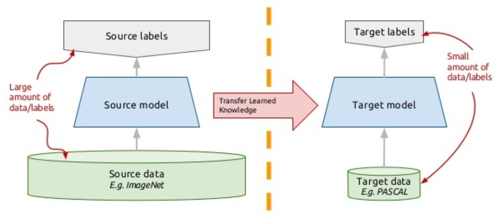

### ❓ Вопросы для самопроверки
-----

1. Объясните, в чем отличия между машинным обучением, математической статистикой и искусственным интеллектом?
2. Объясните отличия model-based и data-driven подходов к построениию моделей.
3. Каковы основные этапы решения задач машиного обучения? Объясните, какие задачи решаются на каждом этапе.
4. Какие задачи решает инженерия признаков?
5. Как можно оценить точность решения задачи машинного обучения? В чем отличия способов оценивания точности для model-based и data-driven подходов?
6. Объясните, в чем отличия машинного обучения с учителем и без учителя?
7. Как ставится задача машинного обучения с частичным привлечением учителя?
8. Приведите примеры практических задач, решаемых методами машинного обучения: а) с учителем; б) без учителя; в) с частичным привлечением учителя.
9. В чем состоит идея обучения ансамблей?
10. В чем состоит идея обучения с подкреплением?
11. В чем состоит идея активного обучения?
12. В чем отличия глубокого обучения от классического машинного обучения?
13. В чем состоит идея трансферного обучения?

### ✅ Тест по разделу
-----

- **Что изучает машинное обучение?**

<!-- data-randomize -->
[[x]] Методы решения задач с использованием обучающих данных.
[[ ]] Методы создания баз данных.
[[ ]] Методы разработки игр.
[[ ]] Методы создания операционных систем.

---

- **Какой подход к моделированию основан на известных законах и правилах?**

<!-- data-randomize -->
[[ ]] Data-driven
[[x]] Model-based
[[ ]] Black box model
[[ ]] White box model

---

- **Какой этап пайплайна машинного обучения включает предобработку данных?**

<!-- data-randomize -->
[[x]] Фаза обучения
[[x]] Фаза использования
[[ ]] Оценка алгоритма
[[ ]] Выбор данных

---

- **Сопоставьте задачи с подходами к моделированию:**

<!-- data-randomize -->
- [(Data-driven) (Model-based) (Black box model) (White box model)]
- [ (x) ( ) ( ) ( )]  Модели, которые обучаются на данных.
- [ ( ) ( ) (x) ( )]  Точные, но сложно интерпретируемые модели.
- [ ( ) (x) ( ) ( )]  Модели, основанные на известных законах и правилах.
- [ ( ) ( ) ( ) (x)]  Менее точные, но легко интерпретируемые модели.

---

- **Сопоставьте задачи с подходами к моделированию:**

<!-- data-randomize -->
- [(Data-driven) (Model-based)]
- [    (x)           ( )]  Предсказание спроса на товары.
- [    ( )           (x)]  Моделирование движения планет.
- [    (x)           ( )]  Классификация изображений.
- [    ( )           (x)]  Расчет траектории полета ракеты.

---

- **Соотнесите модели:**

<!-- data-randomize -->
- [(Black box model) (White box model)]
- [    ( )           (x)]  Линейная регрессия
- [    (x)           ( )]  Ансамбли
- [    (x)           ( )]  Нейронные сети
- [    ( )           (x)]  Деревья решений

---

- **Функция выделения признаков для тестовых данных **должна** совпадать с функцией выделения признаков для обучающих данных?**

[(x)] да
[( )] нет

---

- **В чем ключевое различие между Supervised и Unsupervised Learning?**

<!-- data-randomize -->
[( )] В Supervised Learning данные всегда имеют числовой формат, а в Unsupervised Learning данные могут быть категориальными.  
[(x)] В Supervised Learning требуется наличие размеченных данных, а в Unsupervised Learning данные не требуют разметки.  
[( )] В Supervised Learning используются только линейные модели, а в Unsupervised Learning -- нелинейные.  
[( )] В Supervised Learning данные всегда имеют низкую размерность, а в Unsupervised Learning -- высокую. 

---

- **Представь, что ты агент в задаче обучения с подкреплением. Какое действие ты бы выбрал, чтобы получить долговременный выигрыш?**

[( )] Пойти пить пиво🍺
[(x)] Посмотреть лекцию по машинному обучению👨‍💻

---

- **Выберите верные варианты**

| | |
| Машинное обучение | Глубокое обучение |
| [[(Ручное создание признаков (feature extraction)) | Обучение признаков (feature learning)]] | [[Ручное создание признаков (feature extraction) | (Обучение признаков (feature learning))]] |
| [[(Наличие) | Отсутствие]]  экспертов по формированию признаков | [[Наличие | (Отсутствие)]]  экспертов по формированию признаков  |

---

- **Почему глубокое обучение так популярно в последние годы?**

<!-- data-randomize -->
[( )] Появление принципиально новых идей, которые радикально изменили подход к машинному обучению
[(x)] Развитие технологий, таких как GPU и TPU, и доступность больших объемов данных, что позволило реализовать ранее существовавшие концепции

---

- **Что оказывает наибольшее влияние на качество обученной модели?**

<!-- data-randomize -->
[( )] Выбор алгоритма машинного обучения
[(x)] Качество и релевантность признаков, используемых для обучения
[( )] Объем вычислительных ресурсов, доступных для обучения
[( )] Количество слоев в нейронной сети

---

- **В каких случаях глубокое обучение требует наличия размеченных данных (меток)?**

<!-- data-randomize -->
[( )] Всегда, так как глубокое обучение основано на обучении с учителем.
[( )] Никогда, так как глубокое обучение использует только неразмеченные данные.
[(x)] Только при решении задач классификации или регрессии, где требуется обучение с учителем.
[( )] Только при использовании сверточных нейронных сетей.

## Основные парадигмы машинного обучения

                           --{{0}}--
Поскольку не все шрифты доступны на всех компьютерах (существуют тысячи шрифтов и большинство из них не бесплатны), CSS предусматривает резервную систему. Первым вы указываете шрифт, который хотели бы использовать. Затем следуют любые шрифты, которые вы могли бы использовать, если первый указанный шрифт не доступен. А закончить список вы должны типовым шрифтом, который имеет 5 видов: serif, sans-serif, monospace, cursive и fantasy. 

> "_Let the editor be your canvas and the keyboard your brush._"

## Обучение с учителем: основные принципы

                           --{{0}}--
As already mentioned all you need to work with LiaScript is an text-editor, but
it can be usefull to apply one of the following tools. At least we apply them to
see the result of a change within the course document immediately. You will see,
that the development of online-courses will speed up, especially if there is no
need for memorizing complex point and click sequences.

> "_Let the editor be your canvas and the keyboard your brush._"

## Обучение с учителем: регрессия

                           --{{0}}--
As already mentioned all you need to work with LiaScript is an text-editor, but
it can be usefull to apply one of the following tools. At least we apply them to
see the result of a change within the course document immediately. You will see,
that the development of online-courses will speed up, especially if there is no
need for memorizing complex point and click sequences.

> "_Let the editor be your canvas and the keyboard your brush._"

## Диагностика регрессионных моделей

                           --{{0}}--
As already mentioned all you need to work with LiaScript is an text-editor, but
it can be usefull to apply one of the following tools. At least we apply them to
see the result of a change within the course document immediately. You will see,
that the development of online-courses will speed up, especially if there is no
need for memorizing complex point and click sequences.

> "_Let the editor be your canvas and the keyboard your brush._"

## Бинарная классификация

                           --{{0}}--
As already mentioned all you need to work with LiaScript is an text-editor, but
it can be usefull to apply one of the following tools. At least we apply them to
see the result of a change within the course document immediately. You will see,
that the development of online-courses will speed up, especially if there is no
need for memorizing complex point and click sequences.

> "_Let the editor be your canvas and the keyboard your brush._"

## Многоклассовая классификация

                           --{{0}}--
As already mentioned all you need to work with LiaScript is an text-editor, but
it can be usefull to apply one of the following tools. At least we apply them to
see the result of a change within the course document immediately. You will see,
that the development of online-courses will speed up, especially if there is no
need for memorizing complex point and click sequences.

> "_Let the editor be your canvas and the keyboard your brush._"

## Байесовская классификация

                           --{{0}}--
As already mentioned all you need to work with LiaScript is an text-editor, but
it can be usefull to apply one of the following tools. At least we apply them to
see the result of a change within the course document immediately. You will see,
that the development of online-courses will speed up, especially if there is no
need for memorizing complex point and click sequences.

> "_Let the editor be your canvas and the keyboard your brush._"

## Логистическая регрессия

                           --{{0}}--
As already mentioned all you need to work with LiaScript is an text-editor, but
it can be usefull to apply one of the following tools. At least we apply them to
see the result of a change within the course document immediately. You will see,
that the development of online-courses will speed up, especially if there is no
need for memorizing complex point and click sequences.

> "_Let the editor be your canvas and the keyboard your brush._"